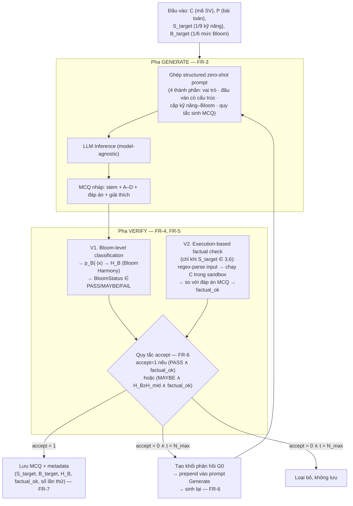

# Tài liệu Yêu cầu (Requirements Engineering)
## Framework sinh – kiểm chứng câu hỏi trắc nghiệm (MCQ) đánh giá năng lực hiểu mã nguồn của sinh viên theo cấp độ nhận thức

> Tài liệu này **bám theo luận văn tham khảo**: Lê Bình Đẳng, *"Phương pháp sinh câu hỏi đánh giá khả năng hiểu mã nguồn của sinh viên theo cấp độ nhận thức"* (Luận văn Thạc sĩ, Trường ĐH Bách khoa – ĐHQG-HCM, 2026) — tệp `docs/references/Master_Thesis_Formated-BD.Le-270826.pdf`.
> Mọi yêu cầu dưới đây phản ánh đúng bài toán, phương pháp và phạm vi của luận văn (xem bảng truy vết ở mục 10).

---

## 1. Giới thiệu

### 1.1 Mục đích tài liệu
Đặc tả yêu cầu chức năng và phi chức năng của một **framework sinh – kiểm chứng câu hỏi trắc nghiệm nhiều lựa chọn (MCQ)** dùng để đánh giá năng lực hiểu mã nguồn (code comprehension) của sinh viên, vận hành trên **mã nguồn thật do sinh viên nộp**. Framework theo mô hình **hai pha Generate – Verify** kèm **vòng lặp Regenerate**, làm cơ sở cho các bước System Design / Architectural Design / Software Design tiếp theo.

Tài liệu **không** mô tả một sản phẩm gia sư thích ứng. Trọng tâm là: *"sinh viên có thật sự hiểu đoạn mã mình (hoặc công cụ) đã nộp hay không"*, trong điều kiện chương trình **đã được xác nhận đúng chức năng**.

### 1.2 Phạm vi hệ thống (bám mục 1.3 luận văn)

**Trong phạm vi:**
- Bối cảnh: học phần **"Kỹ thuật lập trình" (Programming Fundamentals ≈ CS1)** tại Trường ĐH Bách khoa – ĐHQG-HCM.
- Ngữ liệu đầu vào: bài nộp thu từ **LMS** của học phần, ngôn ngữ **C++**, chủ đề CS1 — cấu trúc điều khiển, mảng, hàm, đệ quy, danh sách liên kết đơn.
- **Chỉ xử lý các bài nộp ĐÚNG chức năng** (vượt qua toàn bộ test chính thức). Tách bạch rõ khỏi bài toán tìm lỗi / sửa lỗi.
- Chỉ sinh **MCQ** (1 stem, 4 lựa chọn A–D, đúng 1 đáp án, kèm giải thích).
- Mỗi MCQ gắn với **một cặp (kỹ năng hiểu mã `S_target`, cấp độ Bloom `B_target`)** lấy từ ma trận kỹ năng – Bloom đã định nghĩa (mục 2, FR-2).
- Kiểm chứng tự động gồm: (a) phân loại cấp độ Bloom của câu hỏi, (b) kiểm chứng tính đúng hành vi bằng **thực thi mã sinh viên trong sandbox** (cho kỹ năng truy vết và dự đoán kết quả).
- Thực nghiệm và đánh giá pipeline trên dữ liệu bài nộp thật (rubric sư phạm + chỉ số tự động).

**Ngoài phạm vi (out of scope):**
- Đánh giá trên **lời giải sai**, bài tìm lỗi / debug.
- **Nhiều ngôn ngữ lập trình** (chỉ C++); các bài tập ngoài CS1 (CTDL nâng cao, hệ điều hành…).
- Các dạng bài ngoài MCQ: tự luận, điền khuyết, Parsons, so sánh chương trình.
- Gia sư thích ứng: bài kiểm tra đầu vào thích ứng (CAT), hồ sơ năng lực theo thời gian, sinh lộ trình học, re-plan, nhắc ôn tập spaced repetition, dashboard radar cho người học.
- **RAG / truy xuất ngữ liệu / vector DB / ingest GitHub**: luận văn dùng **structured zero-shot prompting** (không few-shot, không retrieval). Xem Open Issue #7 nếu muốn mở rộng.
- Biên soạn giáo trình; autograder chạy test kiểu Online Judge.
- Triển khai tích hợp LMS ở quy mô sản xuất và đánh giá tác động học tập lâu dài (hướng phát triển — Chương 6 luận văn).

### 1.3 Đối tượng liên quan (Stakeholders)

| Vai trò | Mô tả | Nhu cầu chính |
|---|---|---|
| Nghiên cứu viên / tác giả đề tài | Xây dựng và thực nghiệm framework | Pipeline chạy được end-to-end trên dữ liệu thật; kết quả tái lập được |
| Giảng viên hướng dẫn / Hội đồng | Đánh giá đề tài | Đúng đắn học thuật; giải thích được cơ chế Bloom classification + factual check |
| Giảng viên Khoa học máy tính (người chấm rubric) | Chấm chất lượng MCQ theo rubric 8 tiêu chí | Bộ MCQ trình bày rõ ràng, kèm mã nguồn nguồn và cặp (kỹ năng, Bloom) mục tiêu |
| Giảng viên học phần (người dùng downstream, tương lai) | Dùng bộ MCQ để đánh giá lớp | Truy vết được MCQ ↔ bài nộp; nhãn kỹ năng / Bloom tin cậy |
| Sinh viên | **Nguồn mã nguồn** (không phải người dùng của framework) | Bài nộp được ẩn danh hoá khi đưa vào pipeline |

### 1.4 Ràng buộc & giả định

- **Ngôn ngữ mục tiêu:** C++ (CS1). Bộ kiểm chứng hành vi (FR-5) dùng regex đặc thù cú pháp C-style và trình biên dịch C++ trong sandbox.
- **Đầu vào giả định hợp lệ:** mọi `StudentSubmission` đưa vào pipeline đã pass toàn bộ test chính thức của bài toán tương ứng.
- **LLM cho pha Generate:** thiết kế **model-agnostic** — bất kỳ LLM nào tuân thủ giao diện vào/ra đều thay thế được. Tập mô hình thực nghiệm: GPT-4.1, Llama-4-Maverick-17B, DeepSeek-R1-Distill-Qwen-1.5B, Claude Sonnet 4, Qwen2.5-Coder-32B (tham số suy luận chung: temperature 0.7, top-p 1.0, max output 2000 tokens).
- **Mô hình phân loại Bloom:** encoder họ Transformer tiền huấn luyện trên NL + code (CodeBERT trong luận văn), fine-tune cục bộ.
- **Tài nguyên:** máy cá nhân / server nhỏ; cân nhắc LLM local (Ollama) vs API cloud khi thiết kế độ trễ.
- **Thời gian:** theo lịch đồ án — ưu tiên phần lõi (Generate, Verify, Regenerate, khung 9 kỹ năng, ma trận Bloom, bộ thực nghiệm).
- **Đạo đức dữ liệu:** bài nộp sinh viên được ẩn danh hoá trước khi xử lý; không lưu thông tin định danh trong kho MCQ.

### 1.5 Thuật ngữ & ký hiệu

| Ký hiệu | Ý nghĩa |
|---|---|
| `P` | Mô tả bài toán lập trình (problem statement) |
| `C` | Đoạn mã bài nộp của sinh viên (C++, đã đúng chức năng), có thể ở dạng rút gọn |
| `S_target` | Kỹ năng hiểu mã cần đánh giá — 1 trong **9 kỹ năng** (FR-2) |
| `B_target` | Cấp độ nhận thức Bloom mục tiêu — 1 trong 6 mức (Remember … Create) |
| MCQ | Câu hỏi trắc nghiệm: stem + 4 lựa chọn A–D + 1 đáp án đúng + giải thích |
| `p_B(·|x)` | Phân phối xác suất trên 6 mức Bloom do bộ phân loại dự đoán cho câu hỏi `x` |
| `q_B` | Phân phối mục tiêu (nhãn mềm xoay quanh `B_target`) |
| `H_B` | **Bloom Harmony** = `exp(-D_KL(q_B ‖ p_B))` ∈ (0, 1]; càng gần 1 càng khớp `B_target` |
| `BloomStatus` | `PASS` / `MAYBE` / `FAIL`, suy từ `H_B` và các ngưỡng `H_low`, `H_mid`, `H_high` |
| `factual_ok` | Cờ nhị phân: đáp án đúng của MCQ có khớp kết quả thực thi mã sinh viên hay không |
| `G0` | Khối phản hồi ngắn được *prepend* vào prompt Generate ở lần sinh lại |
| `N_max` | Số lần sinh lại tối đa cho một cặp `(S_target, B_target)` |

---

## 2. Tổng quan phương pháp (bám Chương 4 luận văn)

Đầu vào chung cho cả hai pha: `(C, P, S_target, B_target)`.

**Giao diện phụ trợ (không phải phần lõi):** một UI mỏng cho giảng viên để (1) nộp một bộ `(P, C, S_target, B_target)` và nhận MCQ đã kiểm chứng; (2) chạy sinh hàng loạt trên một tập bài nộp; (3) xem báo cáo đánh giá thực nghiệm (mục 3, FR-9). UI **không** bao gồm chức năng học tập cho sinh viên.

---

## 3. Yêu cầu chức năng (Functional Requirements)

Ký hiệu: **FR-x.y** — nhóm x, yêu cầu y.

### FR-1: Quản lý ngữ liệu đầu vào (Problem & Submission)
- **FR-1.1** Hệ thống nạp được **mô tả bài toán `P`** và **tập bài nộp `C`** của học phần từ export LMS (định dạng tệp/CSV/JSON).
- **FR-1.2** Hệ thống **chỉ nhận** các bài nộp đã được đánh dấu **đúng chức năng** (pass toàn bộ test chính thức). Bài nộp không thoả bị loại khỏi pipeline và ghi log lý do.
- **FR-1.3** Hệ thống **ẩn danh hoá** bài nộp (bỏ MSSV, tên, metadata định danh) trước khi lưu và xử lý.
- **FR-1.4** Hệ thống hỗ trợ **rút gọn mã** (`summarized student code`) — giữ phần liên quan tới bài toán, lược phần không liên quan — để đưa vào prompt Generate, đồng thời vẫn lưu bản đầy đủ để chạy factual check.
- **FR-1.5** Mỗi bài nộp liên kết tới đúng một `Problem`; mỗi `Problem` có thể có nhiều bài nộp.

### FR-2: Khung 9 kỹ năng hiểu mã & ma trận kỹ năng – Bloom
- **FR-2.1** Hệ thống lưu trữ **bộ 9 kỹ năng hiểu mã nguồn** (Chương 3 luận văn), mỗi kỹ năng có định nghĩa và mô tả thao tác nhận thức:
  1. Basic Code Structure Understanding
  2. Function / Variable Roles and Behaviors
  3. Code Tracing / Step-by-Step Execution
  4. Understanding Abstractions and Design Patterns
  5. Implicit Logic and Side Effects Detection
  6. Anticipating Code Output or Behavior
  7. Code Summarization and Intent Explanation
  8. Mental Simulation / Visual Representation
  9. Understanding Syntax and Semantics of Keywords
- **FR-2.2** Hệ thống lưu trữ **ma trận kỹ năng – Bloom (9 × 6)** (Bảng 3.2 luận văn): mỗi ô là một cặp `(kỹ năng, mức Bloom)` với trạng thái **applicable** hoặc **N/A**, kèm mô tả nhiệm vụ nhận thức và tiêu chí đánh giá cho ô applicable.
- **FR-2.3** Pipeline Generate **chỉ nhận** cặp `(S_target, B_target)` ứng với ô **applicable**; cặp trỏ vào ô N/A bị từ chối ngay với thông báo rõ ràng.
- **FR-2.4** Ma trận được tuần tự hoá (ví dụ JSON) và **đưa vào prompt Generate** để mô hình tra cứu được các cặp hợp lệ (FR-3.2, Thành phần 2).
- **FR-2.5** Nội dung khung kỹ năng và ma trận là **dữ liệu cấu hình**, sửa được mà không đổi mã lõi.

### FR-3: Pha Generate — sinh MCQ từ mã nguồn sinh viên
- **FR-3.1** Với đầu vào `(P, C, S_target, B_target)`, hệ thống ghép **structured zero-shot prompt** rồi gọi LLM để sinh MCQ. **Không** dùng ví dụ few-shot, **không** fine-tune mô hình sinh, **không** truy xuất ngữ liệu ngoài.
- **FR-3.2** Prompt gồm **đúng 4 thành phần** (Bảng 4.4 – biến thể V4):
  1. **Vai trò & ngữ cảnh sư phạm:** LLM đóng vai giảng viên / nhà thiết kế đánh giá KHMT; mục tiêu là câu hỏi chẩn đoán năng lực hiểu mã, khuyến khích suy nghĩ chứ không kiểm tra ghi nhớ.
  2. **Đầu vào có cấu trúc:** `P`, `C`, mô tả văn bản 9 kỹ năng và 6 mức Bloom, ma trận kỹ năng – Bloom (JSON).
  3. **Cặp kỹ năng – mức độ mục tiêu:** giải thích ký hiệu `(S_target, B_target)`, ý nghĩa kỹ năng và mức Bloom trong bối cảnh hiểu mã, yêu cầu câu hỏi nhắm đúng cặp này.
  4. **Quy tắc sinh MCQ:** 1 stem + 4 lựa chọn A–D + đúng 1 đáp án + giải thích; ràng buộc: (i) bám cặp kỹ năng–Bloom, (ii) ngôn ngữ rõ ràng không mơ hồ, (iii) distractor hợp lý; ràng buộc định dạng đầu ra.
- **FR-3.3** Đầu ra pha Generate là MCQ có schema cố định: `stem`, `options[4]` gán nhãn A–D, `answer_key ∈ {A,B,C,D}`, `explanation`. Sai schema → coi như lần sinh thất bại, kích hoạt Regenerate (FR-6).
- **FR-3.4** Lớp gọi LLM là **interface chung (model-agnostic)**; đổi LLM (local/cloud, tổng quát/chuyên mã) không sửa business logic (xem NFR-6).
- **FR-3.5** Khi Regenerate yêu cầu (FR-6.3), hệ thống **prepend khối `G0`** vào trước prompt chuẩn ở lần gọi kế, giữ nguyên `(P, C, S_target, B_target)`.
- **FR-3.6** MCQ do pha Generate tạo ra **chưa được chấp nhận**; bắt buộc đi qua pha Verify.
- **FR-3.7** Trước pha Verify, hệ thống chạy **kiểm tra cấu trúc** MCQ: đủ field theo schema; đúng 4 lựa chọn khác rỗng; đúng 1 `answer_key` hợp lệ; `explanation` không tham chiếu nhãn lựa chọn không tồn tại; **không có 2 lựa chọn trùng nhau sau chuẩn hoá** (trim, gộp khoảng trắng, bỏ phân biệt hoa/thường). Lỗi cấu trúc sinh một kết quả kiểm chứng riêng, **không** đẩy MCQ vào kho (FR-7), và kích hoạt Regenerate (FR-6).

### FR-4: Pha Verify — Bloom-level classification
- **FR-4.1** Hệ thống có **bộ phân loại cấp độ Bloom**: đầu vào là toàn bộ MCQ (mã hoá `[CLS] stem [SEP] A) B) C) D) [SEP]`), đầu ra là **phân phối xác suất `p_B(·|x)` trên 6 mức Bloom**.
- **FR-4.2** Bộ phân loại được huấn luyện với **nhãn mềm (soft labels)** xoay quanh nhãn đúng và **hàm mất mát kiểu ordinal** (cross-entropy với nhãn mềm), hệ số làm mịn `λ` (luận văn: `λ = 0.25`) phân bổ xác suất sang các mức lân cận `y±1`, `y±2`.
- **FR-4.3** Hệ thống tính **Bloom Harmony** `H_B = exp(-D_KL(q_B ‖ p_B))`, trong đó `q_B` là phân phối mục tiêu (nhãn mềm quanh `B_target`).
- **FR-4.4** Hệ thống gán **`BloomStatus`** từ `H_B` và ngưỡng cấu hình:
  - `PASS` nếu `H_B ≥ H_high`
  - `FAIL` nếu `H_B ≤ H_low`
  - `MAYBE` nếu `H_low < H_B < H_high` (chủ yếu là lệch off-by-one / off-by-two)
- **FR-4.5** `p_B`, `H_B`, `BloomStatus` được lưu kèm MCQ (FR-7) phục vụ quyết định accept và phân tích.
- **FR-4.6** Lỗi **tải mô hình hoặc lỗi inference** của bộ phân loại Bloom phải được phân biệt rõ với kết quả `FAIL` sư phạm: hệ thống ghi trạng thái `BLOOM_VERIFY_INFRA_ERROR`, **không** coi là `BloomStatus = FAIL`, không tính vào `accept`; job dừng ở trạng thái lỗi hạ tầng để chạy lại sau (NFR-14; Quy tắc nghiệp vụ #4).

### FR-5: Pha Verify — Execution-based factual check
- **FR-5.1** Bộ kiểm chứng hành vi **chỉ kích hoạt khi `S_target ∈ {3, 6}`** (Code Tracing; Anticipating Code Output or Behavior). Với các kỹ năng khác, `factual_ok := True`.
- **FR-5.2** Quy trình khi kích hoạt (Hình 4.3 luận văn):
  1. `inp ← RegexParse_s(stem)` — bộ mẫu regex đặc thù C-style trích mô tả đầu vào từ stem (đối số hàm, giá trị khởi tạo biến, dữ liệu nhập).
  2. `y_true ← Exec(C, inp)` — biên dịch và chạy `C` **trong sandbox** với `inp`; kết quả tham chiếu (giá trị trả về / chuỗi in ra / trạng thái cấu trúc dữ liệu tuỳ loại bài).
  3. `y_mcq ← Decode(answer_key)` — giải mã đáp án được đánh dấu về dạng giá trị ngữ nghĩa.
  4. `factual_ok ← cmp_s(y_true, y_mcq)` — hàm so sánh đặc thù theo loại nhiệm vụ.
- **FR-5.3** Kết quả factual check phân biệt tối thiểu các nhãn: `PASS`, `ANSWER_MISMATCH` (chạy được nhưng đáp án MCQ ≠ kết quả thực thi), `INPUT_PARSE_FAILED` (regex không trích được đầu vào), `COMPILE_ERROR`, `RUNTIME_ERROR`, `TIMEOUT`, `OUTPUT_LIMIT`, `INFRASTRUCTURE_ERROR` (lỗi sandbox/host).
- **FR-5.3a** Ánh xạ về `factual_ok`: `PASS → True`; `ANSWER_MISMATCH → False` (lỗi nội dung → Regenerate). Các nhãn `INPUT_PARSE_FAILED`, `COMPILE_ERROR`, `RUNTIME_ERROR`, `TIMEOUT`, `OUTPUT_LIMIT` mặc định `factual_ok := False` nhưng **gắn cờ nguyên nhân**; một số ca (ví dụ `INPUT_PARSE_FAILED`) có thể cấu hình chuyển sang trạng thái "không kiểm chứng được" thay vì FAIL (Open Issue #10).
- **FR-5.3b** `INFRASTRUCTURE_ERROR` **không** quy thành `factual_ok = False` về mặt nội dung; job dừng ở trạng thái lỗi hạ tầng, không tính vào `accept`, chạy lại sau (Quy tắc nghiệp vụ #4; NFR-14).
- **FR-5.4** Sandbox phải cô lập tài nguyên (CPU/bộ nhớ/thời gian/không truy cập mạng và hệ thống tệp ngoài) — xem NFR-3.
- **FR-5.5** `factual_ok`, **nhãn kết quả (FR-5.3)** và log thực thi (đầu vào, kết quả, nguyên nhân) lưu kèm MCQ (FR-7).

### FR-6: Cơ chế Regenerate (vòng lọc cuối pha Verify)
- **FR-6.1** Hệ thống tính biến nhị phân **`accept`** theo quy tắc:
  - `accept = 1` nếu `BloomStatus = PASS` **và** `factual_ok = 1`
  - `accept = 1` nếu `BloomStatus = MAYBE` **và** `H_B ≥ H_mid` **và** `factual_ok = 1`
  - `accept = 0` trong các trường hợp còn lại
- **FR-6.1a** Cách xử lý `BloomStatus = MAYBE` (chấp nhận có điều kiện `H_B ≥ H_mid`, luôn từ chối, hay luôn Regenerate) là **tham số của policy accept có version**, không hard-code trong mã lõi (Open Issue #1; FR-10).
- **FR-6.2** Nếu `accept = 1` → MCQ được chấp nhận, lưu kèm metadata (FR-7).
- **FR-6.3** Nếu `accept = 0` **và** số lần thử `t < N_max` → hệ thống xây **khối phản hồi `G0`** gồm:
  1. **Tóm tắt nguyên nhân** (ví dụ: *"Bloom harmony thấp, câu hỏi đang gần mức Understand hơn Analyze"* hoặc *"đáp án đúng không khớp kết quả thực thi: chương trình in ra 42 thay vì 36"*).
  2. **Chỉ dẫn điều chỉnh** cụ thể cho lần sinh lại (giữ nguyên `(S_target, B_target)`, tăng yêu cầu phân tích, thiết kế lại kịch bản đầu vào/đáp án cho khớp hành vi hàm…).
  Sau đó quay lại FR-3.5.
- **FR-6.4** Nếu `accept = 0` **và** `t = N_max` → job kết thúc ở trạng thái terminal **`FAILED_EXHAUSTED`**: MCQ **không** vào kho chính, nhưng hệ thống **vẫn lưu toàn bộ các lần thử, khối `G0` và reason code** phục vụ phân tích (NFR-8). Không lặp vô hạn.
- **FR-6.5** `N_max` và các ngưỡng `H_low`, `H_mid`, `H_high` là tham số cấu hình có version (Open Issue #1, #2; FR-10.1).

### FR-7: Lưu trữ MCQ & truy vết
- **FR-7.1** Mỗi MCQ được chấp nhận lưu kèm metadata: `S_target`, `B_target`, `p_B`, `H_B`, `BloomStatus`, `factual_ok`, số lần thử `t`, id `Problem`, id `StudentSubmission` (đã ẩn danh), LLM và biến thể prompt đã dùng.
- **FR-7.2** Từ mỗi MCQ truy ngược được về **đúng bài nộp và bài toán gốc** (phục vụ kiểm chứng của giảng viên).
- **FR-7.3** Hệ thống hỗ trợ **khử trùng lặp nội dung**: loại các MCQ gần trùng nhau (nhiều sinh viên có lời giải tương tự) khi xuất tập dữ liệu.
- **FR-7.4** Hệ thống xuất được tập MCQ (kèm/không kèm metadata) ra định dạng dùng cho huấn luyện và đánh giá (FR-8, FR-9).
- **FR-7.5** Kho MCQ hỗ trợ **lọc** theo `Problem`, `S_target`, `B_target`, `BloomStatus`, LLM / biến thể prompt, khoảng thời gian, số lần thử `t`.
- **FR-7.6** Giảng viên (người chấm rubric / người dùng downstream) có thể **duyệt, từ chối, hoặc ghi chú** một MCQ trong kho; mỗi thao tác được **ghi audit** (chủ thể, thời điểm, MCQ + version, lý do). Trạng thái duyệt của giảng viên tách biệt với biến `accept` tự động.
- **FR-7.7** **Không sửa đè** nội dung một MCQ đã chấp nhận; mọi chỉnh sửa tạo **version mới**, giữ bản cũ và liên kết truy vết.
- **FR-7.8** Chỉ MCQ có `accept = 1` **và** không bị giảng viên từ chối mới xuất ra tập dữ liệu mặc định (FR-7.4).

### FR-8: Huấn luyện & phục vụ mô hình phân loại Bloom
- **FR-8.1** Hệ thống có quy trình **gán nhãn Bloom cho tập MCQ** phục vụ huấn luyện: LLM-as-judge gán nhãn (chỉ thấy stem + 4 lựa chọn + mô tả 6 mức, **không** thấy `B_target`), sau đó lọc nhiều bước:
  - giữ các câu judge trùng khớp **exact-match** với nhãn tham chiếu;
  - bổ sung các câu lệch **off-by-one**, có **thẩm định của ≥ 2/3 giảng viên**;
  - **khử trùng lặp nội dung**.
  (Luận văn: ~20.500 MCQ thô từ ~3.300 bài nộp → **5.809 MCQ duy nhất**, train 4.647 / test 1.162.)
- **FR-8.2** Hệ thống huấn luyện bộ phân loại: encoder Transformer (CodeBERT), **đóng băng 6 tầng dưới / fine-tune 6 tầng trên + tầng phân loại**; soft labels + ordinal loss (FR-4.2). Siêu tham số cấu hình được (luận văn: LR 2e-5, batch 32, max len 256 token, 15 epoch early-stopping patience 4, cosine warmup 10%, weight decay 0.01, `λ = 0.25`).
- **FR-8.3** Hệ thống hỗ trợ **so sánh biến thể mô hình** (ví dụ M1 DeBERTa-v3 / M2 CodeBERT+soft-label+ordinal / M3 CodeBERT+hard-label) để chọn bộ phân loại mặc định phục vụ tính `H_B`.
- **FR-8.4** Bộ phân loại được phục vụ (serve) như một dịch vụ nội bộ cho pha Verify (FR-4.1).

### FR-9: Công cụ thực nghiệm & đánh giá
- **FR-9.1** **Đánh giá bộ phân loại Bloom** trên tập test: `exact accuracy`, `off-by-1 accuracy`, `within-1 accuracy`; precision / recall / F1 theo từng mức Bloom và macro-average.
- **FR-9.2** **Đánh giá chất lượng MCQ bằng rubric 8 tiêu chí** (thang tổng 30):
  | Tiêu chí | Thang |
  |---|---|
  | Skill–Level Match | 0–5 |
  | Personalization | 0–3 |
  | Clarity | 0–3 |
  | Reflective Prompt | 0–3 |
  | Distractor Quality | 0–3 |
  | Answer Correctness | 0–5 |
  | Explanation Quality | 0–3 |
  | Instructional Value | 0–5 |
- **FR-9.3** Quy trình chấm rubric: **5 giảng viên KHMT chấm độc lập** (không biết trước câu hỏi / nhãn tự động); điểm mỗi tiêu chí = trung bình 5 giảng viên.
- **FR-9.4** Tính **độ tin cậy giữa người chấm** bằng **Krippendorff's alpha** cho từng tiêu chí và tổng điểm (`α > 0.8`: tin cậy cao; `0.67 ≤ α ≤ 0.8`: chấp nhận tạm thời).
- **FR-9.5** Kênh đánh giá bổ sung **LLM-as-judge + self-consistency**: cùng rubric, mỗi bộ câu hỏi chấm 5 lần độc lập rồi lấy trung bình; đối chiếu với điểm giảng viên (ví dụ tương quan Pearson).
- **FR-9.6** Hệ thống hỗ trợ **thực nghiệm so sánh cấu hình Generate**: nhiều LLM × nhiều biến thể prompt (V1–V5), báo cáo tỉ lệ *complete set* và điểm rubric trung bình để chọn cấu hình mặc định.
- **FR-9.7** Hệ thống hỗ trợ **thực nghiệm ablation pha Verify**: so sánh "chỉ Generate" với "Generate + Verify" trên Skill–Level Match và Answer Correctness.
- **FR-9.8** Mỗi **lần chạy đánh giá (evaluation run)** cố định và ghi lại: version tập dữ liệu, version ma trận kỹ năng–Bloom, biến thể prompt, tên/phiên bản LLM, version bộ phân loại Bloom, version policy accept, seed (nếu provider hỗ trợ). Kết quả run **truy ngược được tới từng MCQ và từng lần thử (Generation Attempt)**.

### FR-10: Cấu hình & quản trị artifact
- **FR-10.1** Các tham số ảnh hưởng kết quả — provider/LLM, ngưỡng `H_low`/`H_mid`/`H_high`, `N_max`, timeout & giới hạn tài nguyên sandbox, policy xử lý `MAYBE`, biến thể prompt — được quản lý dưới dạng **cấu hình có version**, không rải rác trong mã.
- **FR-10.2** Mọi thay đổi cấu hình ảnh hưởng kết quả sinh / kiểm chứng phải **tạo version mới**; MCQ và kết quả kiểm chứng tham chiếu version đã dùng.
- **FR-10.3** **Cấm xoá cứng** một version artifact/cấu hình (model, prompt, policy, ma trận) đang được lịch sử MCQ hoặc evaluation run tham chiếu; chỉ cho đánh dấu ngừng sử dụng.

---

## 4. Yêu cầu phi chức năng (Non-Functional Requirements)

| Mã | Loại | Mô tả | Tiêu chí đo |
|---|---|---|---|
| NFR-1 | Hiệu năng | Thời gian sinh + kiểm chứng 1 MCQ (Generate + Verify, chưa tính Regenerate) | < 15–20 s trong môi trường thực nghiệm (phụ thuộc LLM) |
| NFR-2 | Thông lượng | Sinh hàng loạt trên tập ~3.300 bài nộp | Chạy được theo lô, có checkpoint / resume |
| NFR-3 | An toàn thực thi | Sandbox cho factual check cô lập CPU, RAM, thời gian chạy; chặn mạng và truy cập FS ngoài | Không có ca thực thi nào ảnh hưởng host; mọi timeout được bắt |
| NFR-4 | Độ chính xác Bloom classifier | within-1 accuracy của bộ phân loại mặc định | ≥ 90% (luận văn M2: 91.2%); exact ≈ 67%, macro-F1 ≈ 0.68 |
| NFR-5 | Chất lượng MCQ | Điểm rubric trung bình của cấu hình mặc định (có pha Verify) | ≥ 29 / 30; Answer Correctness ≥ 4.8 / 5; `α` tổng ≥ 0.8 |
| NFR-6 | Khả năng bảo trì / thay thế | Lớp LLM provider (Ollama local / API cloud) và lớp bộ phân loại Bloom tách sau interface chung | Đổi provider / encoder không sửa business logic |
| NFR-7 | Khả năng tái lập | Thực nghiệm tái chạy cho kết quả tương đương | Seed, phiên bản mô hình, tham số suy luận, prompt được ghi log và versioned |
| NFR-8 | Khả năng giải thích | Với mỗi MCQ (kể cả bị loại), truy được lý do accept / reject | Log `BloomStatus`, `H_B`, `factual_ok`, nội dung `G0`, số lần thử |
| NFR-9 | Khả năng kiểm thử | Test riêng cho pipeline Generate, bộ phân loại Bloom, factual check, cơ chế accept/Regenerate | pytest cho 4 module; test coverage cho lõi |
| NFR-10 | Khả năng triển khai | Toàn bộ hệ thống (dịch vụ pipeline, DB, bộ phân loại, sandbox, LLM nếu local) chạy bằng 1 lệnh | `docker compose up` thành công |
| NFR-11 | Bảo mật & quyền riêng tư | Không lộ API key; bài nộp sinh viên ẩn danh; không lưu dữ liệu định danh | `.env` không commit; kho MCQ không chứa MSSV/tên |
| NFR-12 | Model-agnostic | Prompt zero-shot có cấu trúc hoạt động trên nhiều LLM khác kiến trúc | Chạy được ≥ 3 LLM khác nhà cung cấp không sửa prompt lõi |
| NFR-13 | Khả năng mở rộng ngôn ngữ | `Language profile` đóng gói parser / trình biên dịch–chạy / bộ trích đầu vào / bộ so sánh kết quả cho một ngôn ngữ | Thêm ngôn ngữ mới **không** đổi orchestration contract (Generate–Verify–Regenerate); C++ là profile đầu tiên |
| NFR-14 | Quan sát & phân tách lỗi | Log có `correlation_id` / `job_id` / `attempt_id`; metric lỗi tách **lỗi nội dung** (schema, Bloom FAIL, `ANSWER_MISMATCH`) khỏi **lỗi hạ tầng** (infra error sandbox / tải model / provider) | Mọi lần sinh–kiểm chứng truy được theo ID; báo cáo tỉ lệ 2 loại lỗi riêng biệt |

---

## 5. Yêu cầu dữ liệu (Data Requirements) — sơ bộ

Các thực thể chính (chi tiết hoá ở System / Software Design):

- **Problem** — mô tả bài toán `P`, bộ test chính thức (tham chiếu), chủ đề CS1.
- **StudentSubmission** — mã `C` (bản đầy đủ + bản rút gọn), ngôn ngữ (C++), cờ *đúng chức năng*, liên kết `Problem`, id ẩn danh.
- **Skill** — 9 kỹ năng hiểu mã: mã, tên, định nghĩa, mô tả thao tác nhận thức.
- **BloomLevel** — 6 mức: Remember, Understand, Apply, Analyze, Evaluate, Create.
- **SkillBloomCell** — ô ma trận `(Skill × BloomLevel)`: trạng thái `applicable | N/A`, mô tả nhiệm vụ, tiêu chí đánh giá.
- **MCQ** — `stem`, `options[4]`, `answer_key`, `explanation`, `S_target`, `B_target`, liên kết `Problem` + `StudentSubmission`.
- **VerifyResult** — `p_B` (vector 6 chiều), `H_B`, `BloomStatus`, `factual_ok`, log thực thi sandbox, số lần thử `t`.
- **RegenerateFeedback** — nội dung `G0` (tóm tắt nguyên nhân + chỉ dẫn điều chỉnh) theo từng lần thử.
- **GenerationRun** — LLM (tên, phiên bản, nhà cung cấp), biến thể prompt (V1–V5), tham số suy luận (temperature, top-p, max tokens), thời điểm.
- **BloomLabel** — nhãn Bloom cho MCQ trong tập huấn luyện: nhãn tham chiếu, nhãn LLM-as-judge, nhãn thẩm định của giảng viên, kết luận lọc (exact / off-by-one / loại).
- **EvaluationRecord** — điểm rubric 8 tiêu chí theo từng người chấm (giảng viên hoặc LLM-as-judge), MCQ tương ứng, `α` tính được.
- **Version artifact** — `ProblemVersion`, `SubmissionVersion`, `QuestionVersion` (MCQ), `SkillBloomMatrixVersion`, `PromptTemplateVersion`, `BloomClassifierArtifact` (version mô hình + tokenizer + label mapping), `AcceptPolicyVersion`, `LanguageProfileVersion`.
- **AuditEvent** — thao tác duyệt / từ chối / ghi chú MCQ của giảng viên: chủ thể, thời điểm, MCQ + version, lý do.
- **EvaluationRun** — cố định các version ở FR-9.8; liên kết tới tập MCQ và các lần thử được đánh giá.

Ma trận kỹ năng – Bloom (9 × 6) và bộ định nghĩa 9 kỹ năng được lưu như **artifact cấu hình có version**, đồng thời nạp vào prompt Generate.

### 5.1 Quy tắc dữ liệu

1. **Bất biến (immutable):** một version đã được lịch sử sử dụng (đã có MCQ hoặc evaluation run tham chiếu) không được sửa nội dung — thay đổi tạo version mới.
2. **Không tách rời:** mỗi MCQ luôn giữ liên kết tới đúng `ProblemVersion` và `SubmissionVersion` đã dùng để sinh.
3. **Retention:** raw response của LLM và output sandbox có chính sách lưu trữ / xoá rõ ràng (thời hạn, quyền truy cập); không lưu bí mật hoặc dữ liệu định danh trong log.
4. **Tách định danh:** dữ liệu định danh sinh viên tách khỏi dữ liệu phục vụ đánh giá; tập xuất ra ngoài phải ẩn danh và không vượt quá phạm vi quyền được cấp.
5. **Answer key** không xuất hiện trong API / định dạng lấy câu hỏi trước khi người làm nộp bài (nếu có kênh làm bài).

---

## 6. Quy tắc nghiệp vụ cốt lõi

1. Chỉ cặp `(S_target, B_target)` trỏ vào ô **applicable** của ma trận mới được tạo generation job; cặp `N/A` bị từ chối trước khi gọi LLM.
2. Kiểm tra cấu trúc MCQ (FR-3.7) luôn chạy **trước** kiểm chứng Bloom và factual.
3. Factual check chỉ **bắt buộc** với `S_target ∈ {3, 6}`; kỹ năng khác đặt `factual_ok := True`.
4. **Lỗi hạ tầng** (sandbox, tải / inference model, provider LLM) **không** được tự động quy thành kết quả nội dung `FAIL`; job dừng ở trạng thái lỗi hạ tầng và chạy lại sau.
5. Chỉ `accept = 1` (và không bị giảng viên từ chối) mới đưa MCQ vào kho mặc định và tập xuất.
6. Regenerate không vượt quá `N_max`; hết lượt → `FAILED_EXHAUSTED`, không lặp vô hạn.
7. Mọi quyết định accept / reject / regenerate phải giải thích được bằng **reason code** kèm giá trị (`BloomStatus`, `H_B`, nhãn factual, nội dung `G0`).
8. Mọi MCQ và kết quả kiểm chứng tham chiếu version cấu hình (prompt, policy, ma trận, model) đã dùng; version đã dùng là bất biến.

---

## 7. Tiêu chí nghiệm thu end-to-end

| Mã | Kịch bản | Kết quả mong đợi |
|---|---|---|
| AC-01 | Cặp `(S_target, B_target)` trỏ ô `N/A` | Hệ thống từ chối **trước khi** gọi LLM, nêu rõ lý do |
| AC-02 | LLM trả sai schema MCQ | Đánh dấu lần sinh thất bại (structural); Regenerate nếu `t < N_max` |
| AC-03 | `BloomStatus = FAIL` | Khối `G0` tóm tắt lệch Bloom được prepend vào lần sinh kế |
| AC-04 | `S_target ∈ {3,6}`, đáp án MCQ sai hành vi thực thi | Nhãn factual = `ANSWER_MISMATCH` → `accept = 0` → Regenerate |
| AC-05 | Sandbox timeout | Ghi `TIMEOUT`, áp policy lỗi hạ tầng / nội dung đã chốt, job **không treo** |
| AC-06 | Lỗi tải bộ phân loại Bloom | Trạng thái `BLOOM_VERIFY_INFRA_ERROR`, **không** phải `FAIL`; job dừng chờ chạy lại |
| AC-07 | MCQ đạt mọi kiểm chứng bắt buộc | `accept = 1`; lưu kho + metadata + audit (FR-7) |
| AC-08 | `accept = 0` và `t = N_max` | `FAILED_EXHAUSTED`; lưu đủ mọi lần thử + `G0` + reason code |
| AC-09 | Giảng viên từ chối một MCQ đã `accept` | MCQ bị loại khỏi tập xuất mặc định; thao tác được audit; bản gốc vẫn truy vết được |
| AC-10 | Chạy lại một evaluation run với cùng version / seed | Kết quả tương đương; mỗi metric truy về từng MCQ + lần thử |

---

## 8. Vấn đề còn mở (Open Issues — cần chốt trước khi sang System Design)

1. **Ngưỡng quyết định pha Verify:** giá trị cụ thể `H_low`, `H_mid`, `H_high` và cách hiệu chỉnh chúng trên tập phát triển.
2. **`N_max`:** số lần Regenerate tối đa cho một cặp `(S_target, B_target)`.
3. **LLM mặc định cho pha Generate:** luận văn kết luận Claude Sonnet 4 + prompt V4 (4 thành phần) cho điểm rubric cao nhất (~28.5/30). Cần chốt mô hình dùng trong đồ án (kèm phương án local nếu ràng buộc chi phí).
4. **Encoder & biến thể bộ phân loại Bloom:** xác nhận CodeBERT + soft label + ordinal loss (`λ = 0.25`) làm cấu hình mặc định; có so sánh baseline (DeBERTa-v3, hard-label) hay không.
5. **Độ phủ của `RegexParse` cho factual check:** các mẫu đầu vào C-style được hỗ trợ (đối số hàm, mảng, nhập từ bàn phím, con trỏ / danh sách liên kết); ca không parse được xử lý ra sao ngoài việc set `factual_ok = False`.
6. **Chuẩn `Exec` và `cmp_s`:** định nghĩa kết quả tham chiếu và hàm so sánh cho từng loại nhiệm vụ (giá trị trả về vs chuỗi in ra vs trạng thái cấu trúc dữ liệu).
7. **Mở rộng RAG / few-shot (ngoài luận văn):** hiện **không** dùng. Nếu bổ sung (ví dụ truy xuất lời giải tham chiếu để làm ngữ cảnh, hoặc few-shot ví dụ MCQ mẫu), cần đánh giá lại vì luận văn chủ đích chọn structured zero-shot để giữ tính model-agnostic và không phụ thuộc tập ví dụ.
8. **Nguồn & quy mô dữ liệu thực nghiệm:** xác nhận số bài toán / bài nộp thực tế lấy được từ LMS học phần và thoả điều kiện "đúng chức năng".
9. **Quy mô hội đồng chấm rubric:** luận văn dùng 5 giảng viên; đồ án huy động được bao nhiêu người chấm độc lập.
10. **Phân loại `TIMEOUT` / lỗi thực thi trong factual check:** ca nào coi là "lỗi nội dung" (`factual_ok = False`, Regenerate) và ca nào coi là "không kiểm chứng được / lỗi hạ tầng" (không tính accept, chạy lại). Liên quan FR-5.3a.
11. **Đầu vào cho factual check — structured field vs regex:** luận văn dùng regex trích từ stem (FR-5.2). Có bổ sung phương án cho pha Generate phát kèm **execution spec có cấu trúc** (đối số, stdin, kỳ vọng) để giảm phụ thuộc regex hay không.
12. **Ngưỡng độ tin cậy chấm rubric:** giữ `α ≥ 0.8` (nhất quán luận văn, đạt 0.97) hay siết `α ≥ 0.9`.
13. **Kênh làm bài cho sinh viên:** đồ án có cần demo sinh viên trả lời MCQ + nhận phản hồi (FR làm bài + chấm) hay dừng ở sinh – kiểm chứng – kho MCQ như phạm vi hiện tại.

---

## 9. Ánh xạ với các luồng xử lý

Xem `docs/workflow.md` — cần **viết lại** để đồng bộ với bản RE này (bỏ First Test / lộ trình / adaptive loop / ingestion RAG; thay bằng các luồng: nạp & lọc bài nộp → Generate → kiểm tra cấu trúc → Verify (Bloom + factual) → Regenerate/accept → lưu kho MCQ → **giảng viên duyệt / lọc kho MCQ** → huấn luyện bộ phân loại Bloom → **evaluation run cố định version** & đánh giá).

---

## 10. Truy vết yêu cầu ↔ luận văn tham khảo

| Yêu cầu | Mục trong luận văn |
|---|---|
| Phạm vi (mục 1.2) | 1.3 Phạm vi đề tài |
| FR-1 Ngữ liệu đầu vào, chỉ bài đúng chức năng | 1.3; 5.1.1 Xây dựng tập dữ liệu |
| FR-2 Khung 9 kỹ năng | 3.1 Xây dựng các kỹ năng hiểu mã nguồn; Bảng 3.1 |
| FR-2 Ma trận kỹ năng – Bloom (9×6, N/A) | 3.2; Bảng 3.2 |
| FR-3 Pha Generate, structured zero-shot prompt 4 thành phần | 4.2 Pha Generate; 4.2.2; Bảng 4.4 (V4) |
| FR-3.4 Model-agnostic LLM | 4.2.3 Lựa chọn LLM cho pha Generate; Bảng 4.1 |
| FR-4 Bloom-level classification, soft label, ordinal loss, Bloom Harmony | 4.3.1; công thức `q_B`, `L_Bloom`, `D_B`, `H_B` |
| FR-5 Execution-based factual check (kỹ năng 3 & 6), sandbox | 4.3.2; Hình 4.3 (pseudocode) |
| FR-6 Cơ chế Regenerate, quy tắc `accept`, khối `G0`, `N_max` | 4.4; 4.4.1; 4.4.2 |
| FR-7 Lưu MCQ + metadata, truy vết, khử trùng lặp | 4.4.1; 5.1.1 Bước 3 |
| FR-8 Huấn luyện bộ phân loại Bloom, lọc nhãn nhiều bước | 5.1.1; 5.1.3; Bảng 5.5, 5.6 |
| FR-9.1 Chỉ số Bloom classifier (exact / off-by-1 / within-1, P/R/F1) | 5.2.1; Bảng 5.7, 5.8 |
| FR-9.2–9.4 Rubric 8 tiêu chí, 5 giảng viên, Krippendorff's alpha | 5.2.2; Bảng 5.9, 5.10 |
| FR-9.5 LLM-as-judge + self-consistency | 5.2.3 |
| FR-9.6 So sánh LLM × biến thể prompt | 5.1.2; Bảng 5.11 |
| FR-9.7 Ablation pha Verify | 5.3.2; Bảng 5.12, 5.13 |
| NFR-4 within-1 ≥ 90% | 5.3.1 (M2: exact 67.2%, within-1 91.2%) |
| NFR-5 rubric ≥ 29/30, α ≥ 0.8 | 5.3.2 (28.2 → 29.1 sau Verify; α tổng 0.97) |
| FR-3.7 Kiểm tra cấu trúc MCQ + chống lựa chọn trùng | Kỹ thuật hoá (ngoài luận văn) — chuẩn bị System Design |
| FR-4.6 Tách lỗi hạ tầng bộ phân loại khỏi FAIL sư phạm | Kỹ thuật hoá (ngoài luận văn) |
| FR-5.3 Phân loại kết quả factual chi tiết | Chi tiết hoá 4.3.2 (luận văn chỉ nêu `factual_ok` nhị phân) |
| FR-6.4 Trạng thái `FAILED_EXHAUSTED` | 4.4 (luận văn: "loại bỏ") — đặt tên trạng thái |
| FR-7.5–7.8 Lọc kho, giảng viên duyệt / từ chối, version-on-edit | Kỹ thuật hoá (ngoài luận văn) — vận hành kho MCQ |
| FR-9.8 Evaluation run cố định version | Chuẩn hoá 5.1.2 / 5.2 cho tái lập |
| FR-10 Cấu hình & quản trị artifact có version | Kỹ thuật hoá (ngoài luận văn) — hỗ trợ NFR-7 |
| NFR-13 Language profile | Kỹ thuật hoá — trừu tượng hoá giả định C++ (mục 1.4) |
| NFR-14 Correlation ID + phân tách lỗi nội dung/hạ tầng | Kỹ thuật hoá (ngoài luận văn) |
| Mục 6 Quy tắc nghiệp vụ; Mục 7 Tiêu chí nghiệm thu (AC-01…AC-10) | Kỹ thuật hoá — tổng hợp 4.3–4.4 + chuẩn nghiệm thu |
| Ngoài phạm vi: đa ngôn ngữ, lời giải sai, cấp đề thi / lộ trình, LMS | 6.2 Hướng phát triển |

---

*Bản v2 — viết lại để bám luận văn tham khảo (Generate–Verify–Regenerate, 9 kỹ năng, ma trận Bloom, kiểm chứng thực thi).*
*Bản v2.1 — bổ sung lớp kỹ thuật hoá: kiểm tra cấu trúc MCQ (FR-3.7), phân loại kết quả factual (FR-5.3), tách lỗi hạ tầng khỏi FAIL (FR-4.6, NFR-14), kho MCQ vận hành + duyệt của giảng viên (FR-7.5–7.8), cấu hình & artifact có version (FR-10, mục 5.1), quy tắc nghiệp vụ (mục 6), tiêu chí nghiệm thu AC-01…AC-10 (mục 7). Các mục "ngoài luận văn" được đánh dấu trong bảng truy vết (mục 10).*
*Cần rà soát cùng giảng viên hướng dẫn và cập nhật `docs/workflow.md` cho đồng bộ trước khi sang System Design.*
