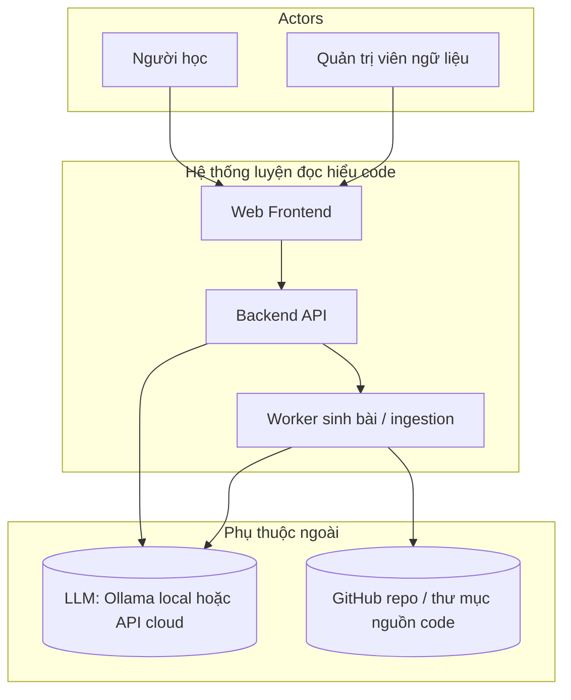
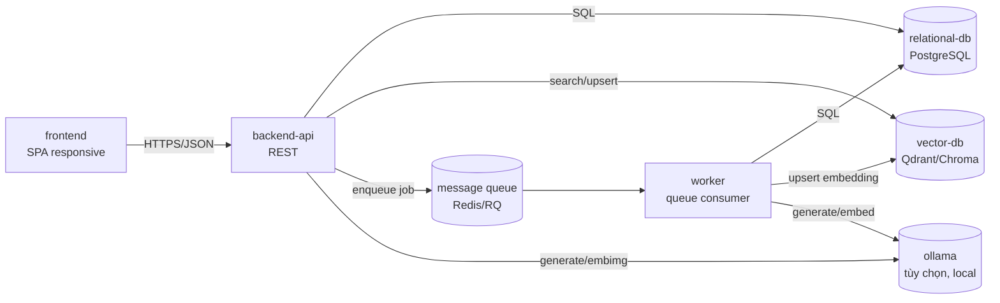
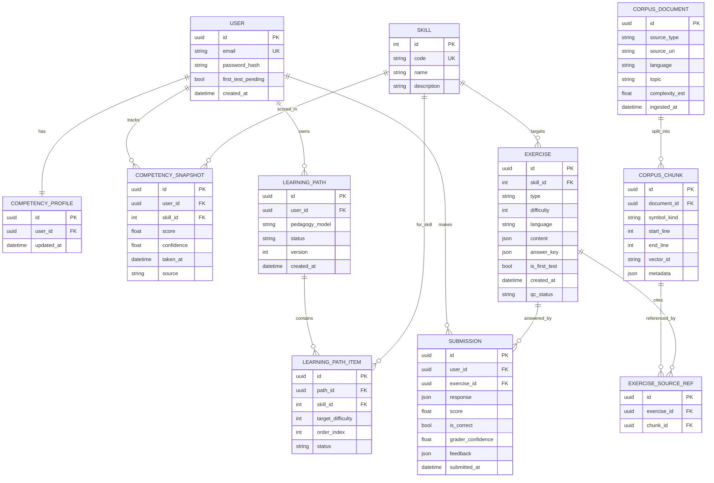
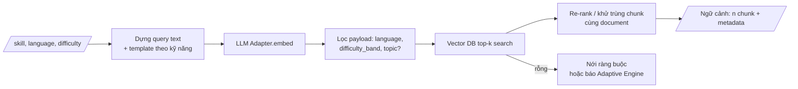
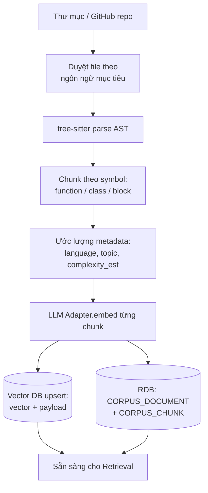
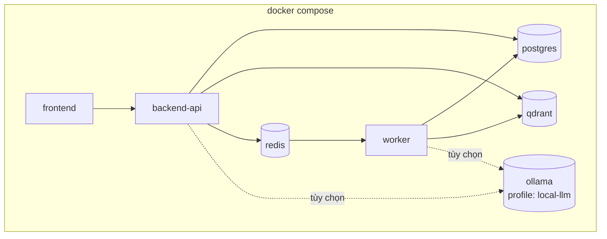

# Tài liệu Thiết kế Hệ thống (System Design)

## Hệ thống luyện tập kỹ năng đọc hiểu mã nguồn thích ứng (LLM + RAG)

Tài liệu này chuyển các yêu cầu trong [RE.md](RE.md) và các luồng trong [workflow.md](workflow.md)
thành thiết kế mức hệ thống: phân rã hệ thống con, mô hình dữ liệu, thiết kế pipeline, API, tech stack,
và cách triển khai. Chi tiết lớp/hàm để ở bước Software Design.

Quy ước tham chiếu: **FR-x.y** / **NFR-x** trỏ về RE.md; **Luồng A–E** trỏ về workflow.md.

---

## 1. Giới thiệu

### 1.1 Mục đích
Làm cơ sở cho Architectural Design và Software Design: chốt ranh giới hệ thống con, hợp đồng dữ liệu,
điểm tích hợp LLM/RAG, và mô hình triển khai bằng Docker Compose (**NFR-2**).

### 1.2 Phạm vi
Bao gồm: web app, backend API, adaptive engine, pipeline RAG, pipeline ingestion ngữ liệu,
vector DB, relational DB, LLM provider adapter.
Không bao gồm: biên soạn giáo trình, chấm chạy test case kiểu Online Judge, native mobile app (theo RE.md §1.2).

### 1.3 Nguyên tắc thiết kế
| # | Nguyên tắc | Bắt nguồn từ |
|---|---|---|
| P1 | Tách LLM provider sau 1 interface chung (Ollama local / API cloud) | NFR-7 |
| P2 | Thêm ngôn ngữ / ngữ liệu mới chỉ qua pipeline ingestion, không sửa code lõi | NFR-3 |
| P3 | Mọi quyết định adaptive (chọn kỹ năng, độ khó) đều ghi log lý do | NFR-9 |
| P4 | RAG pipeline & adaptive engine là 2 module tách biệt, test độc lập bằng pytest | NFR-8 |
| P5 | Bài tập sinh ra qua Quality Gate trước khi hiển thị | FR-4.4, NFR-5 |
| P6 | Toàn hệ thống chạy bằng `docker compose up` | NFR-2 |
| P7 | Bí mật chỉ nạp từ `.env` (không commit); mật khẩu hash | NFR-6 |

---

## 2. Kiến trúc hệ thống

### 2.1 Sơ đồ ngữ cảnh



### 2.2 Sơ đồ container (mức triển khai)



- `worker` tách khỏi `backend-api` để việc sinh bài (RAG + LLM, có thể vài giây — **NFR-1**) và
  ingestion không chặn request đồng bộ. Với môi trường demo nhỏ có thể chạy chung tiến trình,
  nhưng ranh giới module giữ nguyên.
- `ollama` là service tùy chọn; khi dùng API cloud thì bỏ, cấu hình qua `.env` (P1).

### 2.3 Phân rã hệ thống con

| Hệ thống con | Trách nhiệm chính | FR / Luồng | Phụ thuộc |
|---|---|---|---|
| Auth & User | Đăng ký, đăng nhập, phiên, hash mật khẩu | FR-1.1 / A | RDB |
| Competency Service | CRUD hồ sơ năng lực, ghi mốc theo thời gian | FR-1.2, FR-1.3 / A, C | RDB |
| First Test Service | Cấp đề đầu vào, chấm, sinh hồ sơ ban đầu | FR-2 / B | Exercise Gen, Grader, Competency |
| Learning Path Service | Sinh & re-plan lộ trình theo mô hình sư phạm | FR-3 / B, C | Competency Service |
| Adaptive Engine | Chọn {kỹ năng, độ khó, loại bài}; kích hoạt re-plan; log lý do | FR-1.3, FR-3.3 / C | Competency, Learning Path, Submission history |
| RAG Retriever | Sinh truy vấn, lọc metadata, similarity search top-k | FR-4.1, NFR-4 / B, C, E | VDB, LLM Adapter (embedding) |
| Exercise Generator | Prompt LLM sinh bài + đáp án + nhãn | FR-4.2, FR-4.3 / B, C | LLM Adapter, RAG Retriever |
| Quality Gate | Kiểm tra hợp lệ / trùng lặp trước khi hiển thị | FR-4.4, NFR-5 / C | RDB (lịch sử Exercise) |
| Grader | Chấm xác định (MCQ/điền khuyết) + chấm LLM (tự luận) | FR-5.1 / B, C | LLM Adapter |
| Feedback Generator | Sinh giải thích, trích code, gợi ý ôn tập | FR-5.2, FR-5.3 / C | LLM Adapter |
| Progress Service | Tổng hợp dữ liệu Dashboard, biểu đồ, lịch sử | FR-6, FR-1.4 / D | RDB |
| Ingestion Pipeline | parse tree-sitter → chunk → metadata → embedding → lưu | FR-7 / E | VDB, RDB, LLM Adapter |
| LLM Provider Adapter | Interface chung: `generate()`, `embed()`; chọn provider, fallback, retry | NFR-7 / mọi luồng dùng LLM | Ollama / API cloud |
| Corpus Service | CRUD `CorpusDocument`, truy vết nguồn tham chiếu | FR-4.3, FR-7 / C, E | RDB, VDB |

---

## 3. Mô hình dữ liệu

### 3.1 ERD



### 3.2 Ghi chú thiết kế
- **`SKILL`** nạp seed 6 kỹ năng — chờ chốt danh sách (RE.md Open Issue #1). Dùng bảng thay vì enum để thêm/sửa không cần migrate code.
- **`COMPETENCY_PROFILE` vs `COMPETENCY_SNAPSHOT`**: profile giữ trạng thái hiện tại (nhanh để đọc); snapshot ghi từng mốc (`source` = `first_test` | `practice`) phục vụ biểu đồ tiến bộ (FR-1.4, FR-6.1) và giải thích adaptive (NFR-9).
- **`EXERCISE.answer_key`** tách khỏi `content` để không lộ ra client khi render đề.
- **`EXERCISE.qc_status`** = `pending` | `passed` | `rejected` — chỉ `passed` mới hiển thị (P5).
- **`EXERCISE_SOURCE_REF`** hiện thực truy vết nguồn ngữ liệu (FR-4.3): mỗi bài trỏ tới ≥1 `CORPUS_CHUNK`.
- **`CORPUS_CHUNK.vector_id`** là khoá ngoài logic sang Vector DB (không FK cứng).
- **`LEARNING_PATH.version`**: re-plan (FR-3.3) tạo version mới, giữ lịch sử lộ trình.
- Vector DB lưu: `vector`, payload = `{ chunk_id, document_id, language, symbol_kind, topic, complexity_est, difficulty_band }` để lọc trước khi search (§4.1).

---

## 4. Thiết kế các pipeline

### 4.1 RAG Retrieval (FR-4.1, NFR-4)



- `difficulty_band` suy từ `complexity_est` khi ingest → tránh embed lại lúc query.
- Tham số cấu hình: `k`, ngưỡng similarity, số chunk tối đa đưa vào prompt.
- Đo `recall@k` / `precision@k` trên tập test tự tạo (NFR-4) — script riêng trong `tests/rag/`.

### 4.2 Exercise Generation + Quality Gate (FR-4.2 → 4.4, NFR-5)

```mermaid
flowchart TD
    CTX[Ngữ cảnh RAG] --> PB[Build prompt theo\nexercise_type + difficulty]
    PB --> GEN[LLM Adapter.generate\n(JSON schema mong đợi)]
    GEN --> PARSE[Parse + validate schema]
    PARSE -->|lỗi schema| RETRY{retry < N?}
    RETRY -->|có| GEN
    RETRY -->|không| DROP[Bỏ ngữ liệu này\n→ quay lại Retrieval]
    PARSE -->|ok| QG[Quality Gate]
    QG --> C1[Có answer_key hợp lệ, không rỗng]
    QG --> C2[Đúng định dạng theo type\n(MCQ >=2 lựa chọn, đúng 1 đáp án...)]
    QG --> C3[Không trùng/gần trùng bài\ngần đây của user]
    C1 & C2 & C3 -->|đạt| SAVE[(Lưu EXERCISE\nqc_status=passed)]
    C1 & C2 & C3 -->|không| REJ[(qc_status=rejected)\n→ retry hoặc DROP]
    SAVE --> SHOW[Trả về Frontend]
```

- LLM được yêu cầu trả JSON đúng schema theo từng `type`; parser strict.
- Khử trùng (C3): so khớp gần đúng (normalized text / hash n-gram) với `EXERCISE` `passed` gần đây của cùng user.
- Metric NFR-5 = `count(passed) / count(pending)` theo thời gian, log để đối chiếu ngưỡng (Open Issue #5).

### 4.3 Adaptive Engine (FR-1.3, FR-3.3, NFR-9)

Đầu vào: `COMPETENCY_PROFILE`, `LEARNING_PATH` (version hiện tại), N submission gần nhất.
Đầu ra: `{ skill_id, difficulty, exercise_type, reason }`.

Quy tắc (mức system design, chi tiết công thức để ở Software Design):
1. Chọn `skill_id` = kỹ năng có khoảng cách lớn nhất giữa `score` hiện tại và `target` trong lộ trình; ưu tiên kỹ năng yếu (FR-3.1).
2. `difficulty` điều chỉnh theo chuỗi đúng/sai gần đây trên kỹ năng đó (đúng liên tiếp → tăng; sai liên tiếp → giảm), giới hạn bởi `target_difficulty` của `LEARNING_PATH_ITEM` (mô hình scaffolding — FR-3.2, Open Issue #2).
3. `exercise_type` xoay vòng / theo trọng số cấu hình được cho mỗi kỹ năng.
4. Ghi `reason` (kỹ năng yếu nào, độ khó suy ra từ đâu) vào log & `SUBMISSION.feedback`/audit — **NFR-9**.

Kích hoạt re-plan (FR-3.3) khi:
- `score` một kỹ năng tăng ≥ ngưỡng `Δ_up` giữa 2 snapshot gần nhất, hoặc
- ≥ `M` submission sai liên tiếp trên cùng kỹ năng.
→ gọi Learning Path Service tạo `LEARNING_PATH` version mới, `status` version cũ = `superseded`.

### 4.4 Ingestion (FR-7, NFR-3)



- Chạy trong `worker`, kích hoạt qua job từ API (`POST /admin/corpus/ingest`).
- Idempotent: re-ingest cùng `source_uri` + hash file → cập nhật, không nhân đôi.
- Thêm ngôn ngữ mới = thêm grammar tree-sitter + cấu hình, không sửa module khác (NFR-3, P2).

---

## 5. Giao diện API (sơ bộ)

REST/JSON. Xác thực bằng session token (cookie httpOnly hoặc Bearer).

| Nhóm | Method + Path | Mô tả | FR |
|---|---|---|---|
| Auth | `POST /auth/register` | Đăng ký | FR-1.1 |
| Auth | `POST /auth/login` | Đăng nhập | FR-1.1 |
| First Test | `POST /first-test/start` | Bắt đầu (trả câu đầu / bộ đề) | FR-2.1, FR-2.2 |
| First Test | `POST /first-test/answer` | Nộp 1 câu (adaptive) hoặc toàn bộ | FR-2.2 |
| First Test | `POST /first-test/finish` | Chốt → sinh hồ sơ + lộ trình | FR-2.3, FR-3.1 |
| Practice | `GET /practice/next` | Lấy bài tập kế (Adaptive + RAG + LLM + QG) | FR-4 / Luồng C |
| Practice | `POST /practice/{exercise_id}/submit` | Nộp trả lời → chấm + feedback | FR-5 |
| Profile | `GET /me/competency` | Hồ sơ năng lực hiện tại | FR-1.2 |
| Progress | `GET /me/progress` | Dữ liệu Dashboard: snapshot theo thời gian, lịch sử | FR-1.4, FR-6 |
| Learning Path | `GET /me/learning-path` | Lộ trình hiện tại + tiến độ | FR-3 |
| Admin | `POST /admin/corpus/ingest` | Nạp nguồn ngữ liệu mới (enqueue job) | FR-7.1 |
| Admin | `GET /admin/corpus/status` | Trạng thái ingestion + số chunk | FR-7.2 |
| Admin | `GET /admin/quality/exercises` | Thống kê tỉ lệ bài hợp lệ (NFR-5) | FR-4.4 |

`GET /practice/next` có thể trả `202 + job_id` nếu sinh bài vượt ngưỡng đồng bộ; frontend poll `GET /practice/job/{id}`.

---

## 6. Lựa chọn công nghệ

| Thành phần | Lựa chọn đề xuất | Lý do / NFR |
|---|---|---|
| Backend | Python + FastAPI | Hệ sinh thái LLM/RAG, async, pytest (NFR-8) |
| Worker / queue | Redis + RQ (hoặc Celery) | Tách job nặng khỏi request (NFR-1) |
| Relational DB | PostgreSQL | JSON column cho `content`/`answer_key`, giao dịch |
| Vector DB | Qdrant (hoặc Chroma) | Lọc payload + similarity, chạy trong Docker (NFR-2) |
| Parser | tree-sitter | Chunk theo cú pháp, đa ngôn ngữ (NFR-3) |
| LLM local | Ollama (service tùy chọn) | Chạy offline trên máy cá nhân (RE.md §1.4) |
| LLM cloud | Provider qua API, key từ `.env` | Khi cần chất lượng/độ trễ tốt hơn (NFR-6, NFR-7) |
| LLM Adapter | Interface nội bộ `LLMProvider` | `generate()`, `embed()`, cấu hình runtime (P1, NFR-7) |
| Frontend | SPA (React/Vue) responsive | RE.md §1.4, nâng cấp PWA sau |
| Đóng gói | Docker Compose | `docker compose up` (NFR-2, P6) |
| Test | pytest, tách `tests/rag/`, `tests/adaptive/` | NFR-8 |

> Các lựa chọn cụ thể (Qdrant vs Chroma, RQ vs Celery, React vs Vue) chốt ở Architectural Design.

---

## 7. Mô hình triển khai

### 7.1 Services trong `docker-compose.yml`



- `ollama` gắn compose profile `local-llm`; khi dùng cloud thì `docker compose up` không bật service này.
- Biến môi trường nhạy cảm (`LLM_API_KEY`, `POSTGRES_PASSWORD`, `SECRET_KEY`) chỉ trong `.env`, có `.env.example` commit thay thế (NFR-6, P7).
- Volume bền: `postgres_data`, `qdrant_data`, `ollama_models`.
- Healthcheck cho `postgres`, `qdrant`, `redis` trước khi `backend-api` khởi động.

### 7.2 Cấu hình runtime (trích)
| Biến | Ý nghĩa |
|---|---|
| `LLM_PROVIDER` | `ollama` \| `cloud` (P1) |
| `LLM_MODEL` / `EMBED_MODEL` | Tên model generate / embedding |
| `RAG_TOP_K`, `RAG_SIM_THRESHOLD` | Tham số retrieval (§4.1) |
| `GEN_MAX_RETRY` | Số lần sinh lại khi QG fail (§4.2) |
| `TARGET_LANGUAGES` | Danh sách ngôn ngữ ingest (Open Issue #4) |
| `ADAPTIVE_DELTA_UP`, `ADAPTIVE_FAIL_M` | Ngưỡng re-plan (§4.3) |

---

## 8. Ánh xạ NFR → quyết định thiết kế

| NFR | Quyết định thiết kế |
|---|---|
| NFR-1 Hiệu năng < 5–10s | Sinh bài trong `worker`; cache ngữ cảnh RAG theo `{skill,language,difficulty}`; giới hạn số chunk vào prompt |
| NFR-2 1 lệnh Docker Compose | §7; healthcheck + profile cho `ollama` |
| NFR-3 Mở rộng ngôn ngữ/ngữ liệu | Pipeline ingestion độc lập; grammar tree-sitter + `TARGET_LANGUAGES` cấu hình; không FK cứng code↔ngôn ngữ |
| NFR-4 Độ chính xác RAG | Lọc payload trước search; bộ test recall@k/precision@k trong `tests/rag/` |
| NFR-5 Độ tin cậy sinh bài | Quality Gate (§4.2) + `qc_status` + endpoint thống kê admin |
| NFR-6 Bảo mật | `.env` không commit; `password_hash`; `answer_key` không gửi client |
| NFR-7 Bảo trì LLM provider | `LLMProvider` interface, chọn qua `LLM_PROVIDER`, fallback local↔cloud |
| NFR-8 Kiểm thử | RAG & Adaptive tách module; `tests/rag/`, `tests/adaptive/` chạy pytest, có fixture LLM giả |
| NFR-9 Giải thích | `reason` trong Adaptive Engine ghi vào log + audit; `COMPETENCY_SNAPSHOT.source`; `EXERCISE_SOURCE_REF` truy vết ngữ liệu |

---

## 9. Vấn đề mở (kế thừa từ RE.md §5)

| # | Open Issue | Điểm trong thiết kế chờ chốt |
|---|---|---|
| 1 | Danh sách 6 kỹ năng | Seed bảng `SKILL`; template query RAG theo kỹ năng (§4.1) |
| 2 | Mô hình sư phạm | Logic Learning Path Service + ràng buộc `difficulty` trong Adaptive Engine (§4.3) |
| 3 | First Test cố định / CAT | Hợp đồng `POST /first-test/answer` (1 câu vs cả bộ) |
| 4 | Số ngôn ngữ ban đầu | `TARGET_LANGUAGES`; số grammar tree-sitter cần đóng gói |
| 5 | Ngưỡng NFR-4 / NFR-5 | Tiêu chí pass Quality Gate; ngưỡng cảnh báo ở endpoint admin |
| 6 (mới) | Đồng bộ vs bất đồng bộ cho `/practice/next` | Chốt ngưỡng thời gian chuyển sang `202 + job_id` |
| 7 (mới) | Chọn Qdrant vs Chroma, RQ vs Celery | Để Architectural Design quyết |

---

*Bản v1 — đồng bộ với RE.md v1 và workflow.md v1. Rà soát cùng giảng viên hướng dẫn trước khi sang Architectural Design.*
