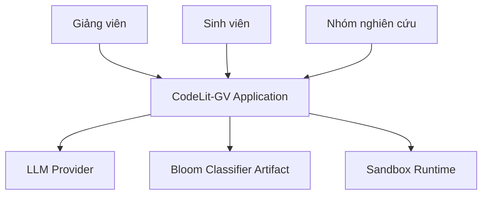
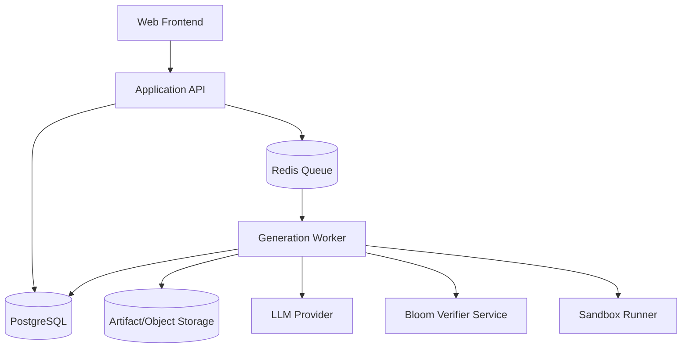
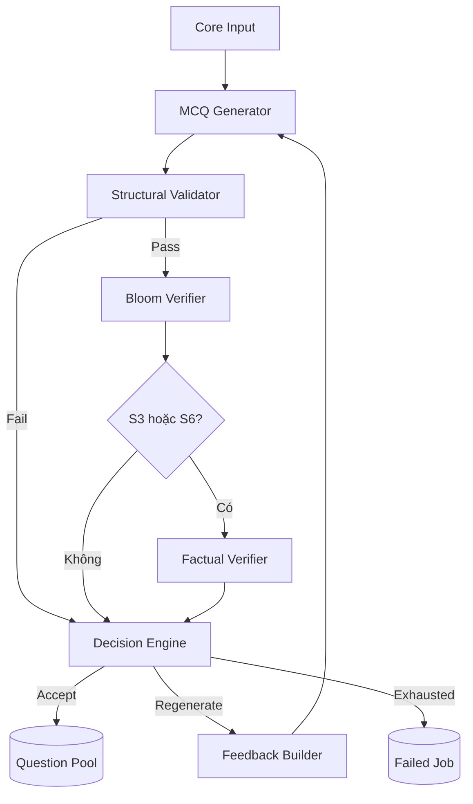
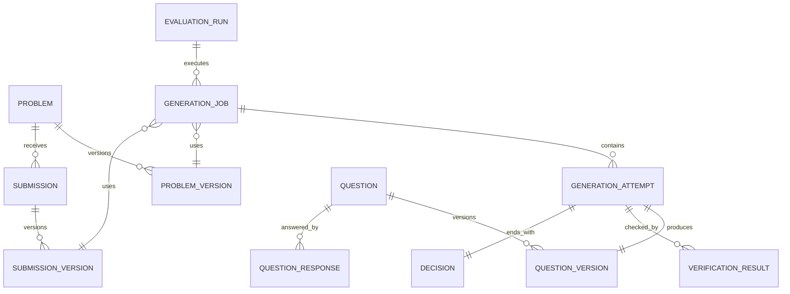
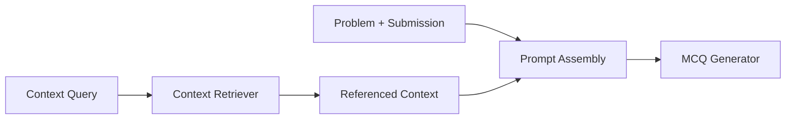

# Tài liệu Thiết kế Hệ thống

## Hệ thống sinh và kiểm chứng câu hỏi đọc hiểu mã nguồn sử dụng LLM

**Phiên bản:** Proposed v2  
**Yêu cầu nguồn:** [RE_PROPOSED.md](RE_PROPOSED.md)  
**Luồng nguồn:** [workflow_PROPOSED.md](workflow_PROPOSED.md)

---

## 1. Mục tiêu thiết kế

Thiết kế hệ thống hóa pipeline CodeLit-GV thành các component có contract, trạng thái, persistence, trust boundary và evaluation pipeline rõ ràng. Core architecture không phụ thuộc RAG, learner model hoặc một LLM provider cụ thể.

### 1.1 Nguyên tắc

| Mã | Nguyên tắc |
|---|---|
| P1 | `Problem + Submission + Starget + Btarget` là core input bất biến |
| P2 | Generator, verifier và policy giao tiếp bằng versioned contract |
| P3 | Mọi attempt và decision đều immutable, traceable |
| P4 | Lỗi nội dung và lỗi hạ tầng là hai nhóm trạng thái khác nhau |
| P5 | Mã sinh viên là untrusted input; chỉ chạy trong sandbox |
| P6 | RAG/adaptive là extension adapter, không nằm trong core dependency bắt buộc |
| P7 | Chỉ accepted question mới được publish vào Question Pool |
| P8 | Evaluation dùng cùng core pipeline với production/demo |

---

## 2. Kiến trúc tổng thể

### 2.1 Sơ đồ ngữ cảnh



### 2.2 Container architecture



`Sandbox Runner` là trust boundary riêng. Worker không chạy trực tiếp mã sinh viên trong process của ứng dụng.

### 2.3 Core orchestration



---

## 3. Phân rã component

| Component | Trách nhiệm | Yêu cầu |
|---|---|---|
| Problem Service | Quản lý Problem/ProblemVersion | FR-01 |
| Submission Service | Quản lý mã nguồn, hash, language profile, trạng thái | FR-02 |
| Target Matrix Service | Kiểm tra cặp skill–Bloom và matrix version | FR-03 |
| Generation Orchestrator | Điều phối lifecycle của job và attempt | FR-04–FR-09 |
| MCQ Generator | Lắp prompt, gọi provider, parse output | FR-04 |
| Structural Validator | Kiểm tra JSON/schema/option/answer | FR-05 |
| Bloom Verifier | Inference, probability, Harmony, status | FR-06 |
| Factual Verifier | Input extraction, answer decoding, comparison | FR-07 |
| Sandbox Runner | Compile/execute mã không tin cậy trong giới hạn | FR-07, NFR-03 |
| Decision Engine | Áp versioned acceptance/regeneration policy | FR-08 |
| Feedback Builder | Tổng hợp reason codes thành structured feedback | FR-08 |
| Question Pool Service | Lưu, lọc, review, version accepted questions | FR-09 |
| Practice Service | Cấp câu hỏi, nhận câu trả lời, chấm MCQ | FR-10 |
| Evaluation Runner | Chạy batch và tổng hợp metric | FR-11 |
| Artifact Registry | Quản lý model/prompt/policy/language versions | FR-12 |
| Audit Service | Lưu sự kiện bất biến và correlation | NFR-05, NFR-12 |

### 3.1 Extension component

| Component | Vai trò | Điều kiện |
|---|---|---|
| Context Retriever | Bổ sung context cho submission nhiều file/tài liệu | EXT-RAG |
| Adaptive Target Selector | Chọn target từ learner history | EXT-ADAPT |
| Learner Profile Service | Lưu evidence theo skill/Bloom | EXT-ADAPT/EXT-GRAD |
| LMS Adapter | Đồng bộ assignment, submission, grade | EXT-GRAD |

Core Orchestrator chỉ biết interface của các extension; khi extension tắt, core pipeline vẫn chạy đầy đủ.

---

## 4. Domain model

### 4.1 Aggregate chính



### 4.2 Bảng dữ liệu cốt lõi

#### `problem` và `problem_version`

| Field | Kiểu | Ghi chú |
|---|---|---|
| `problem.id` | UUID | Stable identity |
| `problem_version.id` | UUID | Immutable version |
| `problem_version.problem_id` | UUID | FK |
| `version_no` | int | Tăng đơn điệu |
| `statement` | text/json | Mô tả có cấu trúc |
| `content_hash` | string | Kiểm tra toàn vẹn |

#### `submission` và `submission_version`

| Field | Kiểu | Ghi chú |
|---|---|---|
| `submission.id` | UUID | Stable identity |
| `problem_id` | UUID | FK |
| `student_ref` | UUID/string | Pseudonymous reference |
| `submission_version.id` | UUID | Immutable version |
| `language_profile_version_id` | UUID | Runtime/parser contract |
| `source_ref` | string/json | Inline hoặc object reference |
| `content_hash` | string | Định danh bytes |
| `validation_status` | enum | `PENDING/VALID/INVALID` |

#### `generation_job`

| Field | Kiểu | Ghi chú |
|---|---|---|
| `id` | UUID | Correlation root |
| `problem_version_id` | UUID | Core input |
| `submission_version_id` | UUID | Core input |
| `skill_code` | string | S1–S9 |
| `bloom_level` | enum | 6 mức Bloom |
| `matrix_version_id` | UUID | Validation source |
| `policy_version_id` | UUID | Decision policy |
| `max_attempts` | int | Snapshot từ policy |
| `status` | enum | Lifecycle state |
| `created_at`, `finished_at` | timestamp | Đo latency |

#### `generation_attempt`

| Field | Kiểu | Ghi chú |
|---|---|---|
| `id` | UUID | Attempt identity |
| `job_id` | UUID | FK |
| `attempt_no` | int | Unique trong job |
| `prompt_version_id` | UUID | Traceability |
| `model_artifact_id` | UUID | Provider/model snapshot |
| `generation_parameters` | json | Temperature, seed... |
| `input_snapshot` | json/ref | Không phụ thuộc dữ liệu mutable |
| `raw_output_ref` | string | Có retention policy |
| `structured_feedback` | json | Rỗng ở attempt đầu |
| `status` | enum | Attempt state |

#### `question_version`

| Field | Kiểu | Ghi chú |
|---|---|---|
| `id` | UUID | Immutable content |
| `question_id` | UUID | Stable identity khi accepted/reviewed |
| `attempt_id` | UUID | Attempt tạo nội dung |
| `stem` | text | Question text |
| `options` | json | Chính xác A–D |
| `correct_option` | string | Mã hóa server-side |
| `explanation` | text | Giải thích |
| `execution_spec` | json nullable | Input/expected semantics cho S3/S6 |
| `schema_version` | string | Contract version |

#### `verification_result`

Dùng bảng cha chung và payload typed hoặc các bảng con:

| Field | Kiểu | Ghi chú |
|---|---|---|
| `id` | UUID | Result identity |
| `attempt_id` | UUID | FK |
| `type` | enum | `STRUCTURAL/BLOOM/FACTUAL` |
| `status` | enum | Type-specific status |
| `artifact_version_id` | UUID nullable | Verifier/model/runtime |
| `result_payload` | json | Schema versioned |
| `started_at`, `finished_at` | timestamp | Latency |
| `error_category` | enum nullable | Content vs infrastructure |

Bloom payload gồm probability vector, target distribution, Harmony score và threshold snapshot. Factual payload gồm extracted input, decoded answer, normalized actual result và sandbox execution reference.

#### `decision`

| Field | Kiểu | Ghi chú |
|---|---|---|
| `attempt_id` | UUID | Một decision/attempt |
| `outcome` | enum | `ACCEPT/REGENERATE/ABORT` |
| `reason_codes` | json array | Machine-readable |
| `feedback_payload` | json | Input cho attempt kế |
| `policy_version_id` | UUID | Policy được dùng |

### 4.3 Invariant

1. `(job_id, attempt_no)` là unique.
2. `attempt_no ≤ max_attempts`.
3. Accepted Question luôn trỏ đến attempt có decision `ACCEPT`.
4. S3/S6 không được accept nếu thiếu factual result `PASS`, trừ khi policy nghiên cứu riêng được version hóa và hiển thị rõ.
5. Question content, verification result và decision đã hoàn tất là immutable.
6. Mọi foreign version reference phải tồn tại trước khi job bắt đầu.

---

## 5. State machine

### 5.1 Generation Job

| Trạng thái | Ý nghĩa |
|---|---|
| `QUEUED` | Đã tạo, chờ worker |
| `GENERATING` | Đang gọi generator |
| `VERIFYING_STRUCTURE` | Kiểm tra schema |
| `VERIFYING_BLOOM` | Chạy Bloom classifier |
| `VERIFYING_FACTUAL` | Chạy sandbox nếu áp dụng |
| `DECIDING` | Áp policy |
| `REGENERATING` | Chuẩn bị attempt kế |
| `ACCEPTED` | Đã đưa vào pool |
| `FAILED_EXHAUSTED` | Hết attempt |
| `FAILED_INFRASTRUCTURE` | Lỗi hạ tầng không thể phục hồi |
| `CANCELLED` | Người dùng/hệ thống hủy |

### 5.2 Transition rules

- Chỉ worker giữ lease hợp lệ mới được chuyển trạng thái đang chạy.
- Mỗi transition ghi `AuditEvent`.
- Retry hạ tầng và regeneration nội dung là hai cơ chế khác nhau.
- Retry hạ tầng không tăng `attempt_no` nếu chưa tạo output nội dung mới.
- Regeneration luôn tăng `attempt_no`.

---

## 6. Contract nội bộ

### 6.1 Core input

```json
{
  "problem_version_id": "uuid",
  "submission_version_id": "uuid",
  "target": {
    "skill": "S3",
    "bloom": "ANALYZE",
    "matrix_version_id": "uuid"
  },
  "configuration": {
    "prompt_version_id": "uuid",
    "model_artifact_id": "uuid",
    "policy_version_id": "uuid"
  }
}
```

### 6.2 MCQ schema

```json
{
  "schema_version": "mcq.v1",
  "stem": "string",
  "options": {
    "A": "string",
    "B": "string",
    "C": "string",
    "D": "string"
  },
  "correct_option": "A",
  "explanation": "string",
  "execution_spec": {
    "input": "optional structured value",
    "observation": "stdout|return_value|state",
    "decoder": "language-profile-defined"
  }
}
```

`execution_spec` bắt buộc cho S3/S6 trong contract ưu tiên. Regex extraction chỉ là fallback có status riêng.

### 6.3 Structured feedback

```json
{
  "failed_checks": ["BLOOM_MISMATCH"],
  "target": {"skill": "S3", "bloom": "ANALYZE"},
  "bloom": {
    "predicted_top": "UNDERSTAND",
    "harmony": 0.42,
    "guidance": "Require analysis of why state transitions cause the result."
  },
  "factual": null,
  "constraints": ["Keep four options", "Keep exactly one correct answer"]
}
```

---

## 7. Thiết kế verifier

### 7.1 Structural Validator

- JSON Schema validation.
- Kiểm tra cardinality A–D.
- Exactly-one answer.
- Normalize và phát hiện duplicate option.
- Giới hạn kích thước stem/option/explanation.
- Không dùng LLM cho các rule xác định được.

### 7.2 Bloom Verifier

Interface:

```text
verify(mcq, target_bloom, artifact_version, policy_version)
  -> probabilities[6], target_distribution[6], harmony, status
```

Artifact Registry phải lưu:

- Model weights reference và checksum.
- Tokenizer version.
- Label order.
- Input serialization version.
- Soft-label parameters.
- Harmony formula version.
- Threshold version.

Không suy ra label order từ vị trí ngầm định trong code.

### 7.3 Factual Verifier

Pipeline:

1. Validate execution spec hoặc parse input fallback.
2. Chọn language profile đúng với submission.
3. Compile trong sandbox nếu cần.
4. Execute với resource limits.
5. Capture bounded output.
6. Decode correct option thành semantic value.
7. Normalize và compare theo task type.
8. Trả factual result và evidence.

### 7.4 Sandbox profile

Mỗi language profile định nghĩa:

- Compiler/interpreter image digest.
- Compile command template.
- Run command template.
- Source layout.
- Input encoding.
- Output normalization/comparator.
- CPU time, wall time, memory, process và output limit.

Yêu cầu runtime:

- Network disabled.
- Non-root user.
- Read-only base filesystem.
- Workspace tạm dung lượng giới hạn.
- Process/cgroup limits.
- Không mount Docker socket hoặc secret.
- Xóa workspace sau run.

---

## 8. Decision Policy

### 8.1 Policy mặc định đề xuất

| Điều kiện | Outcome |
|---|---|
| Structural `FAIL` và còn attempt | `REGENERATE` |
| Bloom `FAIL` và còn attempt | `REGENERATE` |
| Bloom `MAYBE` | Cấu hình: accept có cờ review hoặc regenerate |
| Factual `ANSWER_MISMATCH` và còn attempt | `REGENERATE` |
| Hết attempt với check bắt buộc chưa đạt | `ABORT → FAILED_EXHAUSTED` |
| Verifier infrastructure error sau retry budget | `ABORT → FAILED_INFRASTRUCTURE` |
| Tất cả check bắt buộc đạt | `ACCEPT` |

### 8.2 Reason codes

Tối thiểu:

- `INVALID_SCHEMA`.
- `DUPLICATE_OPTIONS`.
- `BLOOM_MISMATCH`.
- `BLOOM_UNCERTAIN`.
- `FACTUAL_ANSWER_MISMATCH`.
- `FACTUAL_INPUT_UNPARSABLE`.
- `SANDBOX_COMPILE_ERROR`.
- `SANDBOX_RUNTIME_ERROR`.
- `SANDBOX_TIMEOUT`.
- `VERIFIER_UNAVAILABLE`.
- `ATTEMPTS_EXHAUSTED`.

---

## 9. API

### 9.1 Problem và Submission

| Method | Path | Mô tả |
|---|---|---|
| `POST` | `/api/problems` | Tạo Problem/version đầu |
| `POST` | `/api/problems/{id}/versions` | Tạo version mới |
| `POST` | `/api/submissions` | Nạp submission |
| `GET` | `/api/submissions/{id}` | Xem metadata/trạng thái |

### 9.2 Generation

| Method | Path | Mô tả |
|---|---|---|
| `POST` | `/api/generation-jobs` | Validate target và enqueue job |
| `GET` | `/api/generation-jobs/{id}` | Trạng thái tổng thể |
| `GET` | `/api/generation-jobs/{id}/attempts` | Attempts và verification summary |
| `POST` | `/api/generation-jobs/{id}/cancel` | Hủy nếu còn cho phép |

`POST /api/generation-jobs` trả `202 Accepted` cùng `job_id`; client poll hoặc dùng server events ở extension.

### 9.3 Question Pool và Practice

| Method | Path | Mô tả |
|---|---|---|
| `GET` | `/api/questions` | Lọc accepted/reviewed questions |
| `GET` | `/api/questions/{id}` | Chi tiết theo quyền |
| `POST` | `/api/questions/{id}/reviews` | Giảng viên duyệt/từ chối/ghi chú |
| `GET` | `/api/practice/next` | Cấp câu hỏi không kèm đáp án |
| `POST` | `/api/questions/{id}/responses` | Nộp đáp án và nhận feedback |

### 9.4 Evaluation

| Method | Path | Mô tả |
|---|---|---|
| `POST` | `/api/evaluation-runs` | Tạo batch run |
| `GET` | `/api/evaluation-runs/{id}` | Trạng thái và config snapshot |
| `GET` | `/api/evaluation-runs/{id}/metrics` | Metric tổng hợp |
| `GET` | `/api/evaluation-runs/{id}/export` | Export dữ liệu được phép |

### 9.5 Quyền truy cập

- Student không được nhận `correct_option`, internal feedback hoặc raw verification evidence trước khi nộp.
- Instructor xem được Question Pool và evidence theo phạm vi lớp/bài toán.
- Researcher chỉ truy cập dataset/run được cấp quyền và dữ liệu pseudonymized.
- Admin quản lý artifact/config nhưng mọi thay đổi phải audit.

---

## 10. Thiết kế RAG extension

RAG không nằm trên đường phụ thuộc bắt buộc của core. Khi bật:



### 10.1 Nguồn được phép

- Các file khác trong cùng submission/repository snapshot.
- Problem statement và course material có version.
- Skill–Bloom definitions.
- Verified templates/exemplars đã được phê duyệt.

### 10.2 Guardrail

- Mỗi chunk có source, version và checksum.
- Prompt phân biệt rõ student code và retrieved context.
- Retrieval rỗng không làm job lỗi nếu core input vẫn hợp lệ.
- Không lấy code từ sinh viên khác làm code mục tiêu nếu chưa có use case và chính sách dữ liệu rõ ràng.
- Evaluation phải so sánh RAG on/off trên cùng sample/config tương ứng.

---

## 11. Triển khai

### 11.1 Docker Compose đề xuất

| Service | Bắt buộc | Vai trò |
|---|---|---|
| `frontend` | Demo | Web UI |
| `api` | Có | REST API và auth |
| `worker` | Có | Core orchestration |
| `postgres` | Có | Transactional data |
| `redis` | Có | Queue/lease |
| `bloom-verifier` | Có | Model inference; có thể colocate lúc demo |
| `sandbox-runner` | Có | Isolated execution boundary |
| `object-storage` | Tùy | Raw output/artifact/dataset lớn |
| `vector-db` | Chỉ EXT-RAG | Retrieval |
| `ollama` | Tùy provider | Local generation |

### 11.2 Cấu hình

| Biến | Ý nghĩa |
|---|---|
| `GENERATOR_PROVIDER`, `GENERATOR_MODEL` | Generator adapter |
| `PROMPT_VERSION` | Prompt template mặc định |
| `BLOOM_ARTIFACT_VERSION` | Bloom classifier |
| `DECISION_POLICY_VERSION` | Decision thresholds/rules |
| `GEN_MAX_ATTEMPTS` | Giới hạn regeneration |
| `SANDBOX_PROFILE` | Language/runtime profile |
| `SANDBOX_TIMEOUT_MS` | Wall timeout |
| `SANDBOX_MEMORY_MB` | Memory limit |
| `RAW_OUTPUT_RETENTION_DAYS` | Retention policy |

Config thực tế được snapshot vào DB khi tạo job; biến môi trường chỉ chọn default.

---

## 12. Reliability và concurrency

- Queue delivery có thể at-least-once; handler phải idempotent theo `(job_id, attempt_no, stage)`.
- Worker dùng lease có expiry; stage hoàn tất được ghi transactionally trước khi ack.
- External provider timeout sử dụng bounded retry với exponential backoff.
- Không retry tự động đối với deterministic content failure.
- Circuit breaker cho verifier/provider unavailable.
- `ACCEPTED`, `FAILED_EXHAUSTED`, `FAILED_INFRASTRUCTURE`, `CANCELLED` là terminal.

---

## 13. Observability và audit

### 13.1 Structured log fields

`correlation_id`, `job_id`, `attempt_id`, `stage`, `model_version`, `policy_version`, `duration_ms`, `outcome`, `error_category`.

Không log source code, answer key hoặc secret ở log ứng dụng mặc định.

### 13.2 Metric

- Job throughput và terminal status count.
- Latency p50/p95 theo stage.
- Structural/Bloom/factual pass rate.
- Regeneration count distribution.
- Accept rate theo attempt.
- Sandbox timeout/runtime/compile error rate.
- Provider/verifier infrastructure error rate.
- Question Pool review acceptance rate.

---

## 14. Kiểm thử

### 14.1 Test pyramid

| Mức | Nội dung |
|---|---|
| Unit | Matrix validation, schema, Harmony, policy, comparator, state transition |
| Contract | Generator/Bloom/Sandbox adapter schema |
| Integration | DB + queue + fake adapters; sandbox với chương trình mẫu |
| End-to-end | Problem → Submission → Generate → Verify → Pool |
| Evaluation | Dataset cố định, artifact/version cố định, metric report |

### 14.2 Test bắt buộc

1. Invalid skill–Bloom pair.
2. Malformed LLM output.
3. Bloom fail rồi attempt kế pass.
4. Factual mismatch rồi regenerate.
5. Sandbox compile error/runtime error/timeout/output limit.
6. Infrastructure retry không tăng generation attempt.
7. Hết attempt.
8. Duplicate message/idempotency.
9. Student payload không chứa answer key.
10. Accepted question có đủ audit chain.

---

## 15. Tech stack đề xuất

| Thành phần | Đề xuất | Trạng thái quyết định |
|---|---|---|
| Backend/Worker | Python + FastAPI + Pydantic | Phù hợp hệ sinh thái ML |
| Persistence | PostgreSQL | Chốt đề xuất |
| Queue | Redis + RQ/Celery | Chọn sau spike nhỏ |
| Bloom inference | PyTorch/Transformers | Phụ thuộc artifact bàn giao |
| Sandbox | OCI container hoặc sandbox runtime có resource isolation | Phải spike sớm |
| Frontend | React/Vue tối giản | Không ảnh hưởng core |
| Vector DB | Qdrant | Chỉ khi EXT-RAG được chọn |
| Test | pytest + contract fixtures | Chốt đề xuất |

Không chốt framework chỉ bằng sở thích; quyết định cuối phải dựa trên artifact GVHD cung cấp, ngôn ngữ mục tiêu và môi trường demo.

---

## 16. Rủi ro kỹ thuật

| Rủi ro | Tác động | Giảm thiểu |
|---|---|---|
| Không có Bloom model artifact/dataset | Không hiện thực được Verify đúng luận văn | Xác nhận bàn giao ngay; xây adapter + fake trước |
| Factual input khó trích từ natural language | Tỉ lệ parse fail cao | Yêu cầu `execution_spec` có cấu trúc; regex chỉ fallback |
| Sandbox không đủ isolation | Rủi ro bảo mật | Spike runtime sớm; network off/resource limits/test malicious cases |
| Scope RAG/adaptive lấn core | Không hoàn tất đóng góp chính | Gate extension bằng Definition of Done |
| LLM output thiếu ổn định | Nhiều regeneration/exhausted | Strict schema, bounded feedback, metric theo model/prompt |
| Dataset chứa dữ liệu sinh viên | Rủi ro riêng tư | Pseudonymization, access control, retention policy |

---

## 17. Architecture Decision Records cần tạo

1. `ADR-001`: Ngôn ngữ lập trình vertical slice.
2. `ADR-002`: Bloom artifact và serving mode.
3. `ADR-003`: Sandbox runtime và isolation model.
4. `ADR-004`: Structured execution spec so với regex extraction.
5. `ADR-005`: Decision policy cho Bloom `MAYBE`.
6. `ADR-006`: Queue implementation.
7. `ADR-007`: Phạm vi RAG và corpus được phép.

