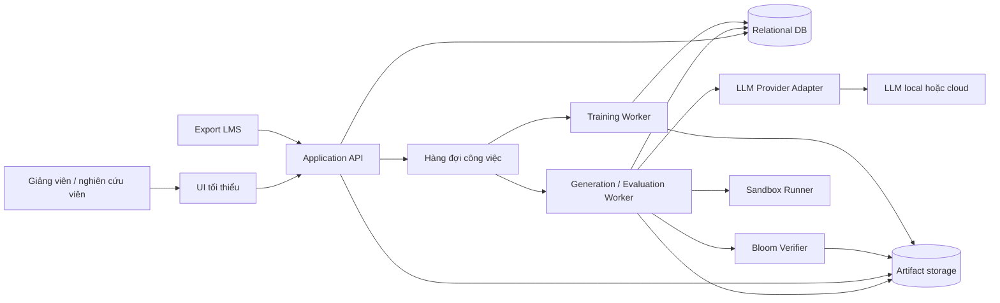
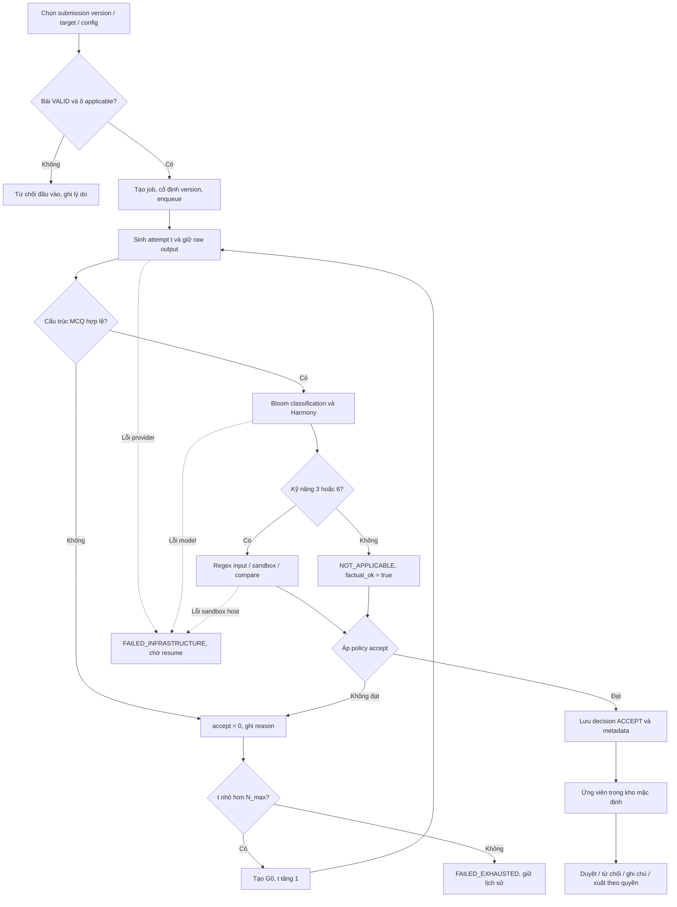
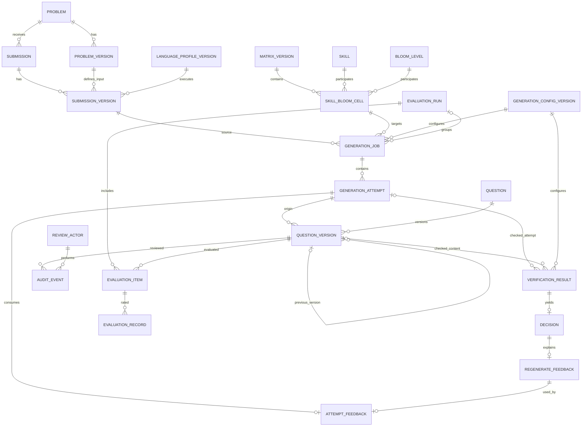

# Tài liệu Thiết kế Hệ thống (System Design)

## Framework sinh – kiểm chứng MCQ đánh giá năng lực hiểu mã nguồn

**Phiên bản:** Proposed v2 — thiết kế theo RE hiện tại, ngày 09/09/2026.
**Yêu cầu nguồn:** [RE.md](RE.md), bản v2.1 tại commit `e122a36`.
**Mô tả dữ liệu:** [ERD_DETAILS.md](ERD_DETAILS.md).
**Trạng thái:** bản thiết kế để nhóm rà soát; chưa phải mô tả phần mềm đã triển khai.

RE là nguồn chuẩn về phạm vi và tiêu chí nghiệm thu. Những lựa chọn về bảng dữ liệu, API, queue và cách triển khai bên dưới là thiết kế nhằm đáp ứng RE; các giá trị hoặc mở rộng chưa được RE chốt được tập hợp tại mục 13. Bản proposed này được đồng bộ với ERD để nhóm rà soát, chưa thay thế `SD.md` trong repo. `RE_PROPOSED.md` là phương án yêu cầu tham khảo riêng, không tự động thay thế `RE.md`. `workflow.md` hiện còn mô tả luồng học thích ứng; luồng tại mục 3 của SD này là luồng dùng cho thiết kế hiện tại, chờ đồng bộ tài liệu workflow riêng.

## 1. Phạm vi và tác nhân

### 1.1 Phần hệ thống cần thiết kế

Framework xử lý bài nộp **C++ thuộc CS1 đã được xác nhận đúng chức năng**, sinh MCQ để đánh giá sinh viên có hiểu mã đã nộp hay không. Đầu vào logic bất biến của một yêu cầu sinh là `(P, C, S_target, B_target)`.

Thiết kế bao gồm:

- Nạp đề bài và bài nộp từ export LMS; lọc điều kiện hợp lệ, ẩn danh và lưu phiên bản mã đầy đủ/rút gọn.
- Quản lý chín kỹ năng, sáu mức Bloom và ma trận 9 × 6 có version.
- Structured zero-shot prompting, kiểm tra cấu trúc MCQ, phân loại Bloom và kiểm chứng bằng thực thi.
- Quyết định accept và vòng Regenerate có giới hạn, lưu lịch sử cả câu đạt lẫn câu bị loại.
- Kho MCQ, giảng viên duyệt/từ chối/ghi chú, chỉnh sửa qua version và xuất dữ liệu.
- Gán nhãn, huấn luyện/serve Bloom classifier, thực nghiệm và chấm rubric.
- Giao diện giảng viên/nghiên cứu viên tối thiểu và cơ chế triển khai bằng Docker Compose.

### 1.2 Ranh giới phạm vi

Không thiết kế CAT/First Test, hồ sơ năng lực người học, learning path, adaptive engine, spaced repetition hoặc dashboard học tập. Không có RAG, vector DB, ingestion GitHub, few-shot hay fine-tune model sinh trong pipeline hiện tại. Không có chấm bài lập trình bằng bộ test Online Judge, xử lý lời giải sai hoặc hỗ trợ nhiều ngôn ngữ ở bản triển khai đầu.

`language_profile_version` tạo ranh giới mở rộng theo NFR-13; profile được hiện thực/nghiệm thu hiện tại là C++. Kênh sinh viên làm MCQ và tích hợp LMS sản xuất vẫn là vấn đề mở của RE, không tạo API/bảng trả lời người học trong core.

### 1.3 Tác nhân

| Tác nhân | Thao tác |
|---|---|
| Nghiên cứu viên | Nạp dữ liệu, cấu hình run, chạy batch, huấn luyện và xem báo cáo |
| Giảng viên | Yêu cầu sinh câu hỏi, xem bằng chứng theo quyền, duyệt kho, chấm rubric và thẩm định nhãn |
| Quản trị vận hành | Cấp quyền, quản lý artifact/version, cấu hình runtime và xử lý lỗi hạ tầng |
| Sinh viên | Là nguồn mã đã nộp trong dữ liệu đầu vào; không phải người dùng trực tiếp của framework hiện tại |

Quản trị vận hành là vai trò kỹ thuật đề xuất, không thêm chức năng học tập. Thông tin định danh gốc của sinh viên không được đưa vào kho MCQ, prompt hay log pipeline.

## 2. Kiến trúc và phân rã thành phần

### 2.1 Sơ đồ triển khai logic



Đây là ranh giới trách nhiệm, không bắt buộc mỗi khối là một microservice. Với demo nhỏ, verifier có thể cùng host với worker nhưng sandbox phải giữ ranh giới cô lập mã sinh viên. DB là nguồn trạng thái bền vững; queue chỉ điều phối công việc. Artifact storage có thể là volume có phân quyền hoặc object storage, lưu model/dataset/mã và log lớn bằng tham chiếu có checksum.

### 2.2 Thành phần và truy vết yêu cầu

| Thành phần | Trách nhiệm | RE |
|---|---|---|
| Input Service | Nạp, lọc, ẩn danh, version đề bài/mã và ghi lý do loại | FR-1 |
| Skill–Bloom Registry | Quản lý ma trận, xác nhận applicable, xuất snapshot vào prompt | FR-2 |
| Prompt Builder | Ghép prompt bốn thành phần và prepend G0 | FR-3.1–FR-3.5 |
| LLM Provider Adapter | Gọi generator theo contract, ghi model/parameters và lỗi provider | FR-3.4; NFR-6, NFR-12 |
| Structural Validator | Kiểm tra schema, bốn lựa chọn, đáp án, giải thích, lựa chọn trùng | FR-3.7 |
| Bloom Verifier | Mã hóa MCQ, suy luận phân phối, tính Harmony và trạng thái | FR-4 |
| Factual Verifier / Sandbox Runner | Trích input, thực thi mã đầy đủ, giải mã và so sánh đáp án | FR-5 |
| Orchestrator / Decision Engine / Feedback Builder | Điều phối attempt, áp policy, G0, dừng hoặc sinh lại | FR-6 |
| Question Pool / Review / Export | Lọc, truy vết, duyệt, tạo version, khử trùng và xuất | FR-7 |
| Labeling / Training | Gán nhãn mù, thẩm định, chia tập, fine-tune classifier | FR-8 |
| Evaluation Runner | Batch cố định version, rubric, ablation và metric | FR-9 |
| Artifact Registry | Version cấu hình, kiểm tra tham chiếu và ngừng sử dụng artifact | FR-10 |

## 3. Luồng xử lý và vòng đời

### 3.1 Luồng sinh một MCQ



Thứ tự được chọn cho bản đầu là kiểm tra cấu trúc → Bloom → factual. Sau một kết quả Bloom hợp lệ, factual vẫn chạy cho S3/S6 kể cả khi Bloom FAIL, để có đủ bằng chứng phản hồi; lỗi hạ tầng thì dừng. Không có bước kiểm chứng nội dung nào được thay bằng một cờ thành công giả khi dependency lỗi.

### 3.2 Quy ước attempt và N_max

Theo định nghĩa N_max ở RE §1.5, `N_max = max_regenerations` là **số lần sinh lại tối đa**. SD dùng `attempt_no = t = 0` cho lần sinh đầu; các lần sinh lại có chỉ số từ 1 tới N_max. Vì vậy tổng số lần sinh nội dung tối đa là `N_max + 1`; N_max bằng 0 vẫn cho phép lần sinh đầu.

Đây là cách diễn giải được chọn để thống nhất định nghĩa với điều kiện `t < N_max` tại FR-6.3. Không dùng tên `max_attempts` cho cùng giá trị. Nhóm cần rà lại cách diễn đạt “số lần thử” trong RE khi hợp nhất tài liệu, nhưng SD/API phải giữ nhất quán quy ước này. Giá trị N_max cụ thể chưa được chốt.

### 3.3 Trạng thái job và phục hồi

| Trạng thái | Ý nghĩa / chuyển tiếp |
|---|---|
| `QUEUED` | Đã kiểm tra đầu vào và cố định version; chờ worker |
| `GENERATING` | Đang gọi generator cho attempt hiện tại |
| `VERIFYING_STRUCTURE` | Kiểm tra output; lỗi nội dung đi tới DECIDING |
| `VERIFYING_BLOOM` | Suy luận classifier; lỗi hạ tầng dừng job |
| `VERIFYING_FACTUAL` | Kiểm chứng S3/S6, hoặc ghi NOT_APPLICABLE |
| `DECIDING` | Ghi decision của lượt kiểm chứng hoàn tất |
| `REGENERATING` | Chuẩn bị G0 và attempt kế tiếp |
| `ACCEPTED` | Kết thúc job sinh; duyệt thủ công là trạng thái độc lập |
| `FAILED_EXHAUSTED` | Kết thúc vì hết lượt, không vào kho chính |
| `FAILED_INFRASTRUCTURE` | Dừng vì lỗi kỹ thuật; chỉ resume khi điều kiện hạ tầng phục hồi |
| `CANCELLED` | Dừng theo yêu cầu người vận hành; giữ lịch sử |

Resume là thao tác được kiểm soát: chỉ cho job ở FAILED_INFRASTRUCTURE, giữ nguyên input/config/target, lấy lại lease rồi tiếp tục stage chưa hoàn tất. Không chuyển job ACCEPTED hoặc FAILED_EXHAUSTED về đầu pipeline; yêu cầu chạy mới tạo job mới. Nếu thay artifact/config để khắc phục lỗi, cũng tạo job mới.

Retry kỹ thuật không làm tăng bộ đếm sinh lại nội dung. Mỗi lần gọi lại provider hoặc verifier phải có log riêng; nếu đã nhận được raw output thì tái dùng output đó để tiếp tục. Nếu provider timeout và không xác định đã sinh hay chưa, adapter ghi trạng thái không chắc chắn, dùng request id/idempotency của provider nếu có; không tuyên bố bảo đảm gọi LLM đúng một lần. Provider không trả output thì có thể chưa có verification_result/decision nội dung; job và log stage vẫn ghi đầy đủ nguyên nhân dừng.

## 4. Generate và các contract

### 4.1 Đầu vào API

```json
{
  "submission_version_id": "uuid",
  "skill_bloom_cell_id": "uuid",
  "config_version_id": "uuid",
  "evaluation_run_id": null
}
```

Backend suy ra P từ `submission_version.problem_version_id`, C từ mã đầy đủ/rút gọn của submission version, S/B từ skill_bloom_cell. Kiểm tra đề bài thuộc đúng problem của submission; skill cell thuộc matrix version đã chọn; các artifact tồn tại, đúng loại, và được phép dùng cho job mới. Nếu thuộc evaluation run, dataset/matrix/config phải khớp snapshot của run.

### 4.2 Prompt và output MCQ

Prompt chuẩn theo FR-3.2 có bốn thành phần: vai trò/ngữ cảnh; P/C và khung kỹ năng/Bloom/ma trận JSON; cặp target; quy tắc MCQ. Toàn bộ template và input thực tế được snapshot. Khi sinh lại, prepend G0 nhưng giữ nguyên input/target. Biến thể V1–V5 phục vụ thực nghiệm FR-9.6, được gắn version và mục đích run rõ ràng.

```json
{
  "stem": "Nội dung câu hỏi",
  "options": [
    {"label": "A", "text": "Lựa chọn A"},
    {"label": "B", "text": "Lựa chọn B"},
    {"label": "C", "text": "Lựa chọn C"},
    {"label": "D", "text": "Lựa chọn D"}
  ],
  "answer_key": "A",
  "explanation": "Giải thích đáp án và hành vi mã liên quan"
}
```

Schema version được cố định bởi prompt template/contract. Lưu `options` dạng JSON nhưng phải kiểm tra đúng bốn label A–D không lặp; mọi text không rỗng; answer_key hợp lệ; không trùng lựa chọn sau trim/gộp khoảng trắng/bỏ phân biệt hoa thường; giải thích không nhắc nhãn không tồn tại. Sai JSON/schema giữ raw response và structural error; chưa bắt buộc tạo question_version hợp lệ. Generator không tự đánh dấu ACCEPT.

Adapter có giao diện logic `generate(prompt_snapshot, parameters, request_id) → raw_output hoặc provider_error`. Thông tin provider/model/version/tham số thuộc generation_config_version và model_artifact; không hard-code tên model trong orchestration. Tham số 0.7/1.0/2000 tokens ở RE là cấu hình thực nghiệm tham chiếu, không mặc nhiên áp dụng cho mọi model.

## 5. Verify, quyết định và feedback

### 5.1 Bloom verification

1. Mã hóa stem và A–D theo FR-4.1; tokenizer, label order và serialization version thuộc artifact classifier.
2. Nhận `p_B` gồm sáu xác suất hữu hạn, không âm và tổng xấp xỉ 1. Output sai contract là lỗi kỹ thuật, không phải FAIL sư phạm.
3. Tạo `q_B` quanh B_target theo soft-label policy có version; tính `H_B = exp(-D_KL(q_B || p_B))`. Chuẩn số học/epsilon và cách xử lý mức biên phải được cố định, kiểm thử; không làm mịn tùy ý ngoài config.
4. Phân loại: PASS khi H_B ≥ H_high; FAIL khi H_B ≤ H_low; MAYBE khi nằm giữa. Ràng buộc cấu hình đề xuất: `0 ≤ H_low < H_mid < H_high ≤ 1`.
5. Lưu p_B, Harmony, BloomStatus và config version; q_B cùng ngưỡng có thể tái dựng từ target/policy bất biến, đồng thời giữ trong evidence khi cần xuất báo cáo.

Lỗi load/inference ghi reason `BLOOM_VERIFY_INFRA_ERROR`, error_category=INFRASTRUCTURE và BloomStatus=NULL. Không gán BloomStatus=FAIL hoặc accept=0 do lỗi này.

### 5.2 Factual verification

**Phương án hiện tại theo FR-5.2 là regex trích input từ stem**, không yêu cầu generator trả execution_spec. Sau khi trích, runner dùng mã **đầy đủ** và language profile đã được cố định; giải mã lựa chọn chỉ bởi answer_key để so sánh giá trị ngữ nghĩa với thực thi thật. Mã rút gọn chỉ phục vụ prompt, không thay thế mã sandbox.

| Nhãn factual | factual_ok | Xử lý mặc định |
|---|---|---|
| `NOT_APPLICABLE` | true | Kỹ năng ngoài S3/S6; không chạy sandbox |
| `PASS` | true | Đáp án khớp thực thi |
| `ANSWER_MISMATCH` | false | Lỗi nội dung, đưa vào decision/feedback |
| `INPUT_PARSE_FAILED` | false | Giữ nguyên nhân riêng, không giả định đã thực thi |
| `COMPILE_ERROR` | false | Giữ stderr có giới hạn và lỗi biên dịch |
| `RUNTIME_ERROR` | false | Giữ kết quả và reason thực thi |
| `TIMEOUT` | false | Dừng tiến trình theo giới hạn; ghi loại timeout |
| `OUTPUT_LIMIT` | false | Dừng/cắt output theo giới hạn và ghi trạng thái |
| `INFRASTRUCTURE_ERROR` | NULL | Dừng job, không tính accept nội dung |

Các dòng false cho lỗi trích/chạy theo mặc định FR-5.3a, không kết luận mọi lỗi đó đều chứng minh đáp án sai. Policy có version có thể phân loại một số trường hợp là “không kiểm chứng được” để dừng chờ xử lý, nhưng không cho chúng tự trở thành PASS. Khi lỗi thực tế ở compiler image/host hoặc dependency, phải phân loại hạ tầng thay vì đánh lỗi mã sinh viên. Quy tắc TIMEOUT/parse đặc biệt cần nhóm chốt theo RE Open Issue #10.

Evidence có input đã trích, đáp án giải mã, kết quả chuẩn hóa, nhãn, thời lượng và log có giới hạn. Regex/comparator phải từ chối dạng input không hỗ trợ thay vì suy đoán. `execution_spec` cấu trúc là mở rộng tại RE Open Issue #11, chưa là dependency của bản này.

### 5.3 Decision policy

Chỉ đánh giá accept khi structural PASS và các bước bắt buộc không có lỗi hạ tầng/không kiểm chứng được. Policy chuẩn FR-6.1:

```text
accept = factual_ok AND (
    BloomStatus == PASS
    OR (BloomStatus == MAYBE AND H_B >= H_mid)
)
```

| Điều kiện | Decision / job |
|---|---|
| Đủ kiểm chứng và accept=true | ACCEPT → job ACCEPTED |
| Không đạt nội dung và t < N_max | REGENERATE → tạo G0, attempt t+1 |
| Không đạt nội dung và t = N_max | ABORT, reason ATTEMPTS_EXHAUSTED → FAILED_EXHAUSTED |
| Lỗi hạ tầng / không thể kiểm chứng theo policy | ABORT nếu có lượt kiểm chứng để tham chiếu; dừng job, không tính accept nội dung |

Biến thể xử lý MAYBE trong FR-6.1a là policy có version, luôn giữ điều kiện factual/structural bắt buộc. G0 nêu reason code, trạng thái/giá trị kiểm chứng và chỉ dẫn điều chỉnh; không thay S/B hoặc thay mã để ép đáp án khớp. Mọi lần thử và G0 vẫn được giữ khi hết budget, theo FR-6.4 dù sơ đồ tổng quan trong RE dùng nhãn ngắn “loại bỏ”.

## 6. Mô hình dữ liệu

### 6.1 Các nhóm thực thể

Mô hình logic gồm 34 bảng, mô tả cột và quan hệ tại [ERD_DETAILS.md](ERD_DETAILS.md). Các bảng version, bảng nối và bảng log dưới đây là cách hiện thực đề xuất; không tuyên bố RE quy định nguyên xi các tên bảng.

| Nhóm | Bảng |
|---|---|
| Ngữ liệu (6) | problem, problem_version, submission, submission_version, language_profile_version, import_event |
| Target/cấu hình (8) | skill, matrix_version, bloom_level, skill_bloom_cell, generation_config_version, prompt_template_version, model_artifact, accept_policy_version |
| Sinh/kiểm chứng (8) | generation_job, generation_attempt, question, question_version, verification_result, decision, regenerate_feedback, attempt_feedback |
| Kho/đánh giá (7) | review_actor, audit_event, evaluation_run, evaluation_item, evaluation_record, rubric_criterion, rubric_score |
| Dataset/huấn luyện (5) | dataset_version, dataset_submission, dataset_question, bloom_label, training_run |

`GenerationRun` ở RE được hiện thực bằng cấu hình version + job + attempt. `MCQ` tương ứng question/question_version; metadata target, ngữ liệu và model được lấy theo chuỗi FK bất biến. `VerifyResult` tương ứng verification_result. Không thêm bảng learner profile, learning path hoặc corpus retrieval vào nhóm này.

### 6.2 ERD quan hệ chính



Sơ đồ này lược bớt bảng rubric/training và các FK cấu hình để dễ theo dõi; danh sách đầy đủ nằm trong ERD_DETAILS. `0..1` ở phía attempt/question_version của verification_result là hai FK nullable, nhưng **ít nhất một FK phải có giá trị**. Nếu có cả hai, chúng phải cùng origin. Một attempt lỗi JSON có thể không tạo question_version; một lần chỉnh tay tạo version mới vẫn truy nguồn về attempt ban đầu.

### 6.3 Bất biến và các unique constraint

- Unique `(problem_id, version_no)` cho problem_version; `(submission_id, version_no)` cho submission_version; `(language, version_no)` cho language_profile_version; `(question_id, version_no)` cho question_version.
- Unique `(matrix_version_id, skill_id, bloom_level_id)`; mỗi ma trận có đủ 54 ô, kể cả N/A. Định nghĩa kỹ năng/Bloom theo version được snapshot để không đổi prompt lịch sử.
- Unique `(job_id, attempt_no)`; attempt đầu bằng 0. Unique `(template_code, version_no)` cho prompt; config/policy có số version duy nhất theo mô hình hiện tại.
- decision có một FK unique tới verification_result. Feedback có một FK unique tới decision. attempt_feedback có PK attempt_id và unique feedback_id; feedback phải từ lần trước của cùng job.
- verification_result/decision đã hoàn tất không sửa đè. Khi retry stage hoặc kiểm chứng version chỉnh sửa, tạo lượt kết quả mới thay vì ghi mất lỗi cũ. Version chỉnh sửa chỉ được đưa vào kho sau kiểm chứng mới; không thừa hưởng ACCEPT của version cũ.
- Tham chiếu về problem phải nhất quán giữa submission và problem_version; origin/previous_version phải giữ cùng question và tăng version_no, không có chu trình.
- Artifact/config/version đang được tham chiếu dùng FK RESTRICT, chỉ được ngừng sử dụng. Retention có thể xóa raw blob theo policy, nhưng giữ metadata/hash và trạng thái hết hạn để không tạo tham chiếu giả tới evidence còn tồn tại.

## 7. Kho câu hỏi, duyệt và xuất

Kho mặc định là truy vấn/view trên **question_version có ACCEPT hợp lệ và không bị giảng viên từ chối**. Sự có mặt của bản ghi question không phải bằng chứng đã vào kho. Trạng thái duyệt lấy APPROVE/REJECT mới nhất theo thứ tự xác định `(created_at, id)`; NOTE chỉ thêm nhận xét. Duyệt thủ công và job ACCEPTED không cập nhật đè lẫn nhau.

Chỉnh sửa tạo question_version mới cùng origin và liên kết previous_version; chạy lại verifier bằng config được ghi rõ. Nếu bản chỉnh sửa không đạt, nó không vào tập xuất; lịch sử bản gốc vẫn còn. UI/endpoint luôn nhận version id khi duyệt, chấm hoặc xuất để tránh lấy nhầm nội dung mới hơn.

Lọc kho theo problem, skill, Bloom, BloomStatus, generator/prompt, khoảng thời gian và số lần sinh lại; metadata được truy qua FK, không sao chép các ID dễ lệch. Xuất JSON/CSV theo schema có version; giữ danh sách question_version đã xuất và thông tin khử trùng trong manifest artifact. Hash dùng cho trùng chính xác; gần trùng cần phương pháp/ngưỡng được cấu hình và ghi lại. Khử trùng lúc xuất không xóa các attempt lặp trong lịch sử.

Review audit lưu subject/version, actor, thời điểm và lý do. Log lifecycle/job nằm trong log vận hành có correlation, không dùng audit_event chỉ dành cho APPROVE/REJECT/NOTE để chứa mọi loại sự kiện. Payload cho người chấm có thể ẩn nhãn tự động theo quy trình đánh giá; nếu sau này có kênh làm bài, phải thiết kế contract không lộ đáp án trước khi nộp theo RE §5.1, không tái dùng endpoint evidence của giảng viên.

## 8. Dataset, huấn luyện và đánh giá

### 8.1 Gán nhãn và huấn luyện Bloom

Dataset version giữ membership của submission/MCQ, nhãn tham chiếu, split và hash. Dataset còn biên soạn có thể cập nhật; trước training/evaluation phải đóng băng membership, nhãn được dùng, các phiếu thẩm định và config lọc. `bloom_label` giữ từng phiếu; dataset_question giữ kết luận lọc cuối.

LLM-as-judge chỉ nhận stem, A–D và định nghĩa sáu mức, **không nhận B_target/nhãn tham chiếu**. Giữ exact-match; bổ sung off-by-one khi được ít nhất 2/3 giảng viên thẩm định; khử gần trùng trước chia train/validation/test để hạn chế rò rỉ nội dung. Các tỉ lệ/kích thước dữ liệu trong luận văn là mốc tham khảo, không tự coi là dữ liệu đã có trong dự án.

Training run ghi model nền, dataset version, siêu tham số, seed, metrics và output artifact. Baseline bám FR-8.2: CodeBERT, đóng băng sáu tầng dưới, fine-tune sáu tầng trên và đầu phân loại; soft labels + ordinal loss. Những tham số của RE như LR 2e-5, batch 32, tối đa 256 token, 15 epoch, patience 4, warmup 10%, weight decay 0.01 và λ=0.25 được đưa vào config thí nghiệm có version. Có thể so sánh các biến thể classifier theo FR-8.3 mà không thay contract verifier.

Artifact được serve kèm weights/checksum, tokenizer, label mapping, serialization version và metadata huấn luyện. Thay model không được tự hoán đổi thứ tự sáu nhãn hoặc mất khả năng truy lại model đã dùng.

### 8.2 Evaluation run

Mỗi run cố định dataset/matrix/config/seed, chế độ `GENERATE_ONLY` hoặc `GENERATE_VERIFY`, và danh sách item được đánh giá. So sánh nhiều LLM × prompt hoặc ablation bằng các run có cấu hình riêng, cùng tập input phù hợp. GENERATE_ONLY giữ MCQ nghiên cứu sau structural validation nhưng không tự tạo ACCEPT hoặc đưa vào kho mặc định. Attempt lỗi cấu trúc vẫn được tính trong thống kê thất bại.

Phiếu rubric lưu từng actor và repetition_no, mỗi phiếu hoàn tất có tám điểm cùng rubric version:

| Tiêu chí | Điểm tối đa |
|---|---:|
| Skill–Level Match | 5 |
| Personalization | 3 |
| Clarity | 3 |
| Reflective Prompt | 3 |
| Distractor Quality | 3 |
| Answer Correctness | 5 |
| Explanation Quality | 3 |
| Instructional Value | 5 |

Theo FR-9, năm giảng viên chấm độc lập, không xem kết quả tự động hoặc phiếu của người khác; nhãn mục tiêu chỉ được cung cấp khi rubric yêu cầu và tách khỏi nhãn classifier. Kênh LLM-as-judge có năm lượt độc lập, giữ model/prompt/parameters trong evidence và phiếu trước khi lấy trung bình. Số giảng viên thực tế còn cần nhóm xác nhận, không âm thầm hạ điều kiện nghiệm thu.

Báo cáo gồm exact/off-by-1/within-1 accuracy; precision/recall/F1 theo lớp và macro; điểm rubric trung bình, Answer Correctness, Krippendorff's alpha theo từng tiêu chí/tổng và Pearson khi đối chiếu hai kênh chấm. Alpha là metric tổng hợp từ nhiều phiếu, không phải điểm riêng của một phiếu. Báo cáo ghi mẫu số, số mẫu thiếu/không kiểm chứng được và lỗi hạ tầng riêng. Định nghĩa complete set, tập cặp applicable được yêu cầu và mẫu số của run phải ghi trong manifest; không suy từ số câu đã ACCEPT để làm tăng tỷ lệ đạt.

## 9. API và quyền truy cập đề xuất

| Method / đường dẫn | Mục đích | RE |
|---|---|---|
| `POST /api/imports` | Nạp export, trả báo cáo nhận/loại đã ẩn danh | FR-1 |
| `POST /api/problems/{id}/versions` | Tạo version đề bài | FR-1; §5.1 |
| `POST /api/submissions/{id}/versions` | Tạo version mã và evidence hợp lệ | FR-1; §5.1 |
| `GET /api/matrix-versions/{id}` | Xem kỹ năng/Bloom và các ô | FR-2 |
| `POST /api/generation-jobs` | Kiểm tra input và enqueue; trả 202 + job_id | FR-3–FR-6 |
| `GET /api/generation-jobs/{id}` | Trạng thái/checkpoint và reason | FR-6; NFR-14 |
| `GET /api/generation-jobs/{id}/attempts` | Lịch sử lần sinh, verification và G0 | FR-7; NFR-8 |
| `POST /api/generation-jobs/{id}/resume` | Tiếp tục job lỗi hạ tầng, giữ config | NFR-2, NFR-14 |
| `POST /api/generation-jobs/{id}/cancel` | Yêu cầu dừng job đang xử lý | Vận hành đề xuất |
| `GET /api/question-versions` | Lọc kho theo metadata và trạng thái duyệt | FR-7.5 |
| `GET /api/question-versions/{id}` | Nội dung/evidence theo quyền | FR-7.1–FR-7.2 |
| `POST /api/questions/{id}/versions` | Tạo bản chỉnh sửa, chưa được ACCEPT | FR-7.7 |
| `POST /api/question-versions/{id}/verify` | Kiểm chứng version chỉnh sửa bằng config cố định | FR-7.7; §5.1 |
| `POST /api/question-versions/{id}/reviews` | APPROVE/REJECT/NOTE có audit | FR-7.6 |
| `POST /api/exports` | Cố định tập version, khử trùng và xuất | FR-7.3–FR-7.8 |
| `POST /api/dataset-versions` | Tạo snapshot dữ liệu biên soạn | FR-8, FR-9.8 |
| `POST /api/dataset-questions/{id}/labels` | Ghi phiếu judge/thẩm định theo quyền | FR-8.1 |
| `POST /api/training-runs` | Enqueue training với dataset/artifact config | FR-8 |
| `POST /api/evaluation-runs` | Tạo thực nghiệm cố định version | FR-9 |
| `POST /api/evaluation-items/{id}/records` | Ghi phiếu rubric độc lập | FR-9.2–FR-9.5 |
| `GET /api/evaluation-runs/{id}/metrics` | Báo cáo và manifest truy vết | FR-9.1–FR-9.8 |
| `POST /api/config-versions` | Tạo config mới, không sửa version đã dùng | FR-10 |

API nạp dữ liệu tạo stable identity mới khi chưa có; các endpoint version dùng cho identity đã tồn tại. Endpoint nền trả job/run id và trạng thái polling; payload sai trả lỗi validation có reason, tuyệt đối không enqueue cặp N/A.

Mọi thao tác staff được xác thực; giảng viên chỉ duyệt/chấm tập được cấp quyền, người nghiên cứu quản lý dataset/run được giao, quản trị quản lý cấu hình. Cơ chế auth cụ thể chờ nhóm chọn, không thiết kế đăng ký tài khoản sinh viên. Khóa provider chỉ được nạp cho adapter; endpoint evidence không trả secrets và log mặc định không chứa toàn bộ mã/đáp án.

## 10. Sandbox, lưu trữ và độ tin cậy

Sandbox phải chặn mạng, giới hạn CPU/RAM/wall time/process/output và hệ thống tệp; dùng user không đặc quyền, workspace tạm có quota, không mount secret hoặc Docker socket vào môi trường chạy mã. Template compile/run, image digest, regex và comparator thuộc language profile có version. Compile lẫn run đều phải nằm trong ranh giới cô lập; cleanup chỉ xóa workspace của lần chạy tương ứng.

Queue có thể giao lặp. Worker dùng lease/checkpoint và unique constraint để không tạo trùng attempt/decision; không tin rằng queue bảo đảm exactly-once. Chỉ một worker được quyền hoàn tất stage tại một thời điểm. Persist raw output/evidence và metadata trước khi đánh dấu stage hoàn tất; lưu decision và cập nhật job trong transaction trước ack. Nếu artifact storage không cùng transaction DB, ghi artifact trước, kiểm tra hash rồi ghi DB; dọn blob mồ côi bằng chính sách riêng.

Không đổi cấu hình job đang chạy qua biến môi trường. Resume giữ cấu hình cũ; run lại với config mới có ID mới. Retry kỹ thuật có budget/backoff riêng; content failure đi qua Regenerate có G0 và N_max. Log có correlation_id/job_id/attempt_id/stage/duration/error_category; review audit là dữ liệu nghiệp vụ riêng.

Retention raw LLM output, mã và sandbox evidence cần thời hạn/quyền truy cập rõ. Chỉ giữ dữ liệu đã ẩn danh; mapping định danh nếu cần phải ở nguồn/tầng xử lý riêng được cấp quyền. Export phải lọc dữ liệu nhạy cảm và ghi manifest version, không xuất toàn bộ log vận hành mặc định.

## 11. Triển khai và mục tiêu phi chức năng

Đề xuất tiếp tục dùng backend/worker Python, relational DB và queue bền vững như các ranh giới đã nêu; lựa chọn thư viện, runtime sandbox và phiên bản dependency sẽ chốt ở bước triển khai. Không coi danh sách bên dưới là môi trường đã được cài/chạy thành công.

| Service/nhóm tiến trình | Vai trò |
|---|---|
| `api`, `frontend` | API staff và UI mỏng; có thể dùng API trực tiếp cho demo |
| `worker`, `queue` | Sinh/batch/evaluation, lease và checkpoint |
| `relational-db` | Metadata/version/history, đề xuất PostgreSQL |
| `bloom-verifier` | Serve classifier đã được version; có thể cùng host worker |
| `sandbox-runner` | Thực thi C++ cô lập theo profile |
| `artifact-storage` | Volume có phân quyền hoặc object storage |
| `training-worker` | Profile offline cho gán nhãn/huấn luyện |
| `local-llm` | Profile tùy chọn khi dùng provider local |

Mục tiêu NFR-10 là khởi động các thành phần runtime đã chọn bằng `docker compose up`, với healthcheck và artifact model sẵn sàng; chưa tuyên bố đạt khi chưa có compose/kiểm thử. `.env` chứa secrets và tham chiếu config mặc định, không chứa cấu hình mutable để thay kết quả job lịch sử. API/worker từ chối nhận job nếu artifact bắt buộc chưa được chuẩn bị.

| NFR | Thiết kế / phép đo |
|---|---|
| NFR-1 | Đo một lần Generate+Verify, chưa tính Regenerate; mục tiêu RE <15–20 s theo môi trường thực nghiệm |
| NFR-2 | Batch, queue, checkpoint/resume; kiểm tra tập quy mô khoảng 3.300 bài nộp khi có dữ liệu |
| NFR-3 | Test cô lập sandbox, chặn mạng/FS và giới hạn tài nguyên |
| NFR-4 | Báo cáo within-1 ≥90% trên test set cố định; chưa là kết quả đo của dự án |
| NFR-5 | Mục tiêu rubric ≥29/30, Answer Correctness ≥4.8/5, alpha tổng ≥0.8 |
| NFR-6 | Contract provider/classifier độc lập, thay adapter không đổi orchestration |
| NFR-7 | Snapshot input/config/model/prompt/seed; ghi giới hạn tái lập của provider |
| NFR-8 | Giữ cả rejected/exhausted attempts, reason và G0 |
| NFR-9 | Kiểm thử riêng generator, Bloom, factual, policy; báo cáo coverage lõi |
| NFR-10 | Kiểm thử khởi động Compose và healthcheck end-to-end |
| NFR-11 | Ẩn danh, secrets ngoài repo, quyền evidence/export và retention |
| NFR-12 | Ma trận kiểm chứng cùng contract/prompt qua ít nhất ba nhà cung cấp/model theo RE |
| NFR-13 | Profile parser/compiler/input/comparator; chỉ C++ ở bản đầu |
| NFR-14 | Tách metric nội dung/hạ tầng, correlation và trạng thái phục hồi |

## 12. Kế hoạch kiểm thử và truy vết nghiệm thu

Unit test tập trung validator ma trận/MCQ, Harmony và boundary ngưỡng, policy, comparator, giới hạn Regenerate. Contract test dùng fake provider/classifier/sandbox; integration test kiểm tra DB/queue/idempotency và runtime cô lập. Evaluation thực dùng dataset/model đã cố định; không dùng kết quả fake để tuyên bố đạt mục tiêu chất lượng.

| AC của RE | Kịch bản kiểm thử thiết kế |
|---|---|
| AC-01 | Cặp N/A bị từ chối trước enqueue/gọi LLM; có reason |
| AC-02 | JSON/schema/duplicate options lỗi; lưu structural result, chưa tạo MCQ hợp lệ nếu parse thất bại |
| AC-03 | Bloom FAIL sinh G0; attempt sau giữ cùng P/C/S/B và config |
| AC-04 | S3/S6 ANSWER_MISMATCH làm accept=false; kiểm tra Regenerate và evidence |
| AC-05 | TIMEOUT dừng tiến trình; đúng factual_error_policy, không treo job |
| AC-06 | Load/inference classifier lỗi: BLOOM_VERIFY_INFRA_ERROR, BloomStatus=NULL, job dừng |
| AC-07 | Đủ kiểm chứng → ACCEPT; truy lại metadata/evidence và trạng thái kho |
| AC-08 | Với N_max đã cấu hình, t chạy 0..N_max; hết lượt giữ toàn bộ attempt/G0/reason |
| AC-09 | REJECT thủ công loại version khỏi export mặc định, giữ nội dung/audit gốc |
| AC-10 | Run cùng input/config/seed: so sánh kết quả theo điều kiện tái lập, metric truy về version/attempt |

Kiểm tra bổ sung: N_max=0; H_B đúng tại H_low/H_mid/H_high; S khác 3/6 không gọi sandbox; queue giao lặp; resume không mất lỗi trước; artifact đang dùng không xóa được; version chỉnh sửa chưa verify không xuất được; judge không thấy B_target/nhãn tự động; người dùng không có quyền không đọc evidence hoặc sửa phiếu của người khác.

## 13. Điểm cần nhóm thống nhất

Các điểm sau chưa được tự chốt thành yêu cầu mới. Thiết kế core phía trên vẫn dùng phạm vi của RE hiện tại.

| Điểm | Phương án hiện tại trong SD | Cần xác nhận |
|---|---|---|
| Ngưỡng H_low/H_mid/H_high và MAYBE | Policy chuẩn FR-6.1, có version | Giá trị/ngưỡng hiệu chỉnh và biến thể dùng trong thực nghiệm |
| N_max | Số lần sinh lại; attempt đầu 0 | Giá trị cụ thể và thống nhất cách diễn đạt trong RE |
| Generator / classifier | Adapter model-agnostic; baseline classifier theo FR-8 | Model/artifact được bàn giao, cấu hình chạy thực tế |
| Regex và comparator | Theo FR-5.2; từ chối input không hỗ trợ | Phạm vi đối số/mảng/pointer/đệ quy và cách so sánh từng kỹ năng |
| Lỗi thực thi | Mặc định FR-5.3a, hạ tầng tách riêng | Mapping TIMEOUT/parse/compile theo nguyên nhân thực tế |
| Structured execution spec | Chưa yêu cầu, theo Open Issue #11 | Có mở rộng không và thí nghiệm so sánh với regex |
| Dataset / rubric panel | Snapshot và năm giảng viên theo RE | Dữ liệu lấy được, số người chấm thực tế và điều chỉnh RE nếu cần |
| Complete set / khử gần trùng | Manifest ghi cặp yêu cầu, thuật toán và mẫu số | Định nghĩa/ngưỡng để mọi thành viên tính metric giống nhau |
| Hạ tầng | DB + queue + artifact storage + sandbox | Công nghệ cụ thể, tài nguyên, retention và cơ chế xác thực staff |
| RAG, adaptive, kênh làm bài | Ngoài core của bản này | Chỉ thiết kế thêm sau khi nhóm cập nhật phạm vi RE |
| Bộ tài liệu | SD này và ERD_DETAILS theo RE | Đồng bộ workflow/README và xử lý bộ PROPOSED trong lần hợp nhất nhóm |

## 14. Thay đổi so với SD v1 để hỗ trợ rà soát nhóm

| SD v1 | SD v2 theo RE hiện tại |
|---|---|
| Người học đăng ký, First Test và hồ sơ năng lực | Staff nạp bài C++ đã đúng chức năng và yêu cầu sinh MCQ |
| Adaptive Engine / Learning Path | Job–attempt và Generate–Verify–Regenerate |
| RAG Retriever / Corpus / Vector DB | P/C gốc cùng ma trận, structured zero-shot prompt |
| Quality Gate chung | Structural Validator, Bloom Harmony và factual sandbox riêng |
| Bài tập nhiều dạng và chấm câu trả lời | MCQ A–D đúng một đáp án, kiểm chứng câu hỏi sinh ra |
| Retry chung | Regenerate nội dung có G0/N_max; lỗi hạ tầng dừng và resume riêng |
| ERD user/competency/path/exercise/corpus | ERD ngữ liệu/version/attempt/verification/review/evaluation |
| Dashboard tiến bộ | Báo cáo thực nghiệm và độ tin cậy rubric |

Bản SD v1 còn trong lịch sử Git để so sánh; bản v2 không thay đổi nội dung RE và chưa thay đổi các tài liệu PROPOSED. Mọi mục tiêu hiệu năng/chất lượng ở đây là tiêu chí cần kiểm chứng khi triển khai, không phải kết quả đã đạt.
