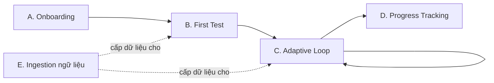
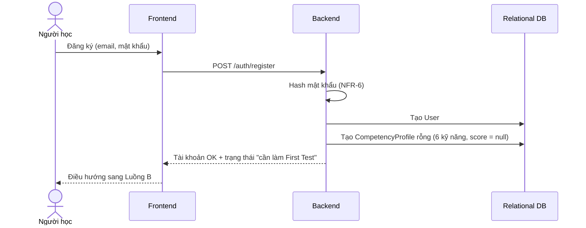
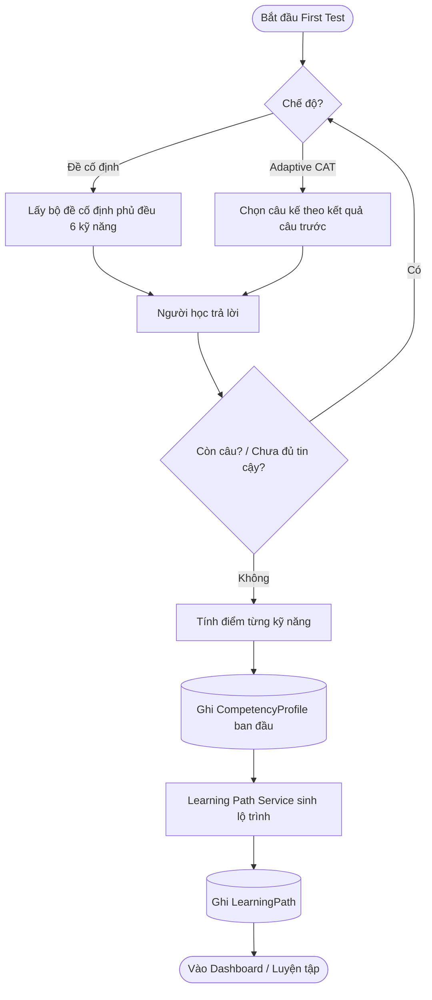
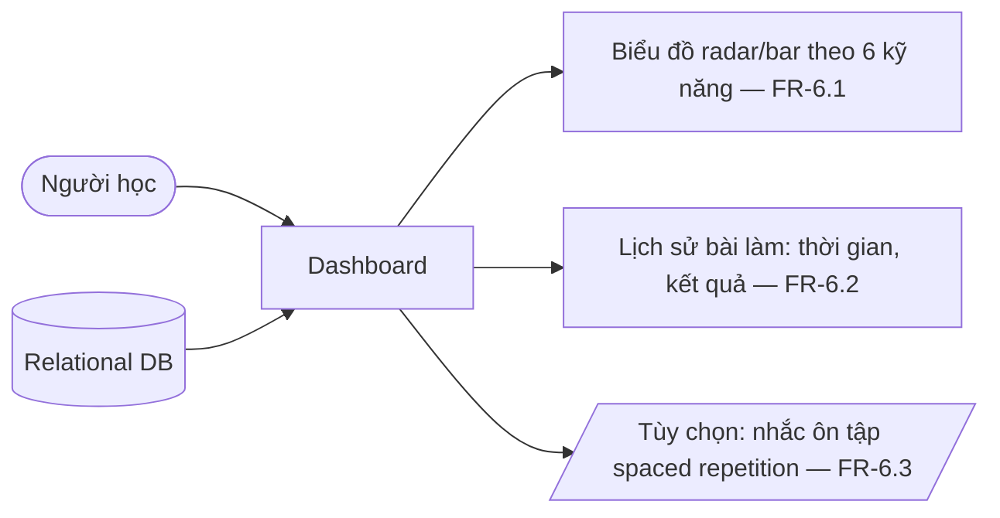
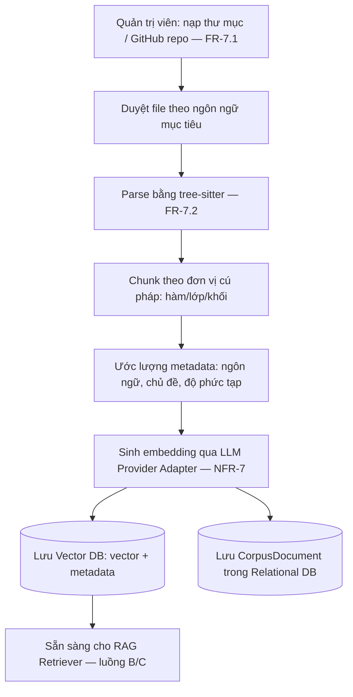
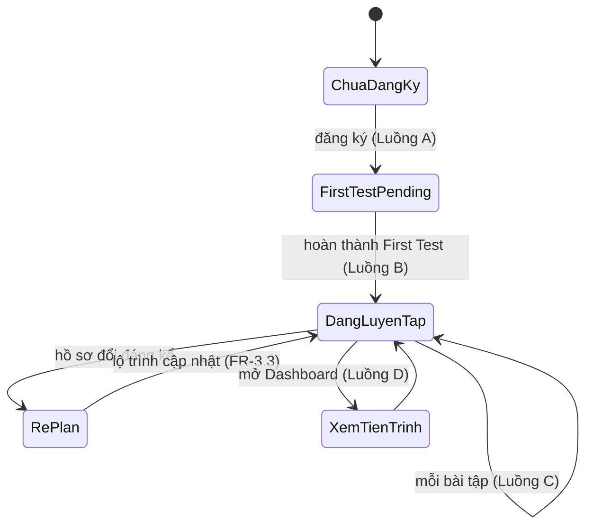

# Workflow hệ thống

## Hệ thống luyện tập kỹ năng đọc hiểu mã nguồn thích ứng (LLM + RAG)

Tài liệu này mô tả các luồng xử lý chính của hệ thống, bám theo [Tài liệu Yêu cầu (RE.md)](RE.md).
Mỗi bước có tham chiếu tới mã yêu cầu **FR-x.y** / **NFR-x** tương ứng.

---

## 1. Tổng quan các luồng

| # | Luồng | Kích hoạt bởi | FR liên quan |
|---|---|---|---|
| A | Onboarding & khởi tạo hồ sơ năng lực | Người học đăng ký lần đầu | FR-1.1, FR-1.2 |
| B | First Test → hồ sơ ban đầu + lộ trình | Sau onboarding | FR-2, FR-3 |
| C | Vòng lặp luyện tập thích ứng (adaptive loop) | Người học chọn "Luyện tập" | FR-3.3, FR-4, FR-5, FR-1.3 |
| D | Theo dõi tiến trình | Người học mở Dashboard | FR-6 |
| E | Nạp & xử lý ngữ liệu (ingestion) | Quản trị viên nạp nguồn code mới | FR-7 |

Quan hệ giữa các luồng:



---

## 2. Thành phần tham gia (logical components)

| Thành phần | Vai trò |
|---|---|
| Web Frontend | Giao diện người học (responsive) — FR-1.4, FR-6 |
| API / Backend | Điều phối nghiệp vụ, xác thực, chấm điểm |
| Adaptive Engine | Chọn kỹ năng mục tiêu + độ khó, cập nhật hồ sơ, quyết định re-plan — FR-1.3, FR-3.3 |
| Learning Path Service | Sinh & cập nhật lộ trình theo mô hình sư phạm — FR-3 |
| RAG Retriever | Truy vấn vector DB lấy ngữ liệu theo kỹ năng/ngôn ngữ/độ khó — FR-4.1, NFR-4 |
| Exercise Generator (LLM) | Sinh bài tập từ ngữ liệu đã truy xuất — FR-4.2, FR-4.3 |
| Quality Gate | Kiểm tra hợp lệ bài tập trước khi hiển thị — FR-4.4, NFR-5 |
| Grader | Chấm trắc nghiệm/điền khuyết bằng đối chiếu; chấm tự luận bằng LLM — FR-5.1 |
| Feedback Generator (LLM) | Sinh phản hồi có giải thích, trích dẫn code — FR-5.2, FR-5.3 |
| Ingestion Pipeline | parse (tree-sitter) → chunk → embedding → lưu vector DB + metadata — FR-7.2 |
| LLM Provider Adapter | Interface chung cho Ollama local / API cloud — NFR-7 |
| Relational DB | User, CompetencyProfile, Exercise, Submission, LearningPath, CorpusDocument — mục 4 RE.md |
| Vector DB | Embedding các chunk ngữ liệu + metadata |

---

## 3. Luồng A — Onboarding & khởi tạo hồ sơ năng lực

**Mục tiêu:** tạo tài khoản và khung hồ sơ năng lực 6 kỹ năng ở mức 0 / chưa xác định.



Bước:
1. Đăng ký / đăng nhập — **FR-1.1**. Mật khẩu hash, không log; API key chỉ đọc từ `.env` — **NFR-6**.
2. Tạo bản ghi `CompetencyProfile` gắn với `User`, 1 dòng / kỹ năng, giá trị khởi tạo rỗng — **FR-1.2**.
3. Đánh dấu tài khoản `first_test_pending = true` → chặn vào Luồng C cho tới khi hoàn thành Luồng B.

> Phụ thuộc Open Issue #1 (RE.md): danh sách 6 kỹ năng phải chốt trước khi hiện thực bảng `Skill`.

---

## 4. Luồng B — First Test → hồ sơ ban đầu + lộ trình

**Mục tiêu:** đo năng lực đầu vào phủ đều 6 kỹ năng — **FR-2.1**, rồi sinh hồ sơ + lộ trình — **FR-2.3**, **FR-3.1**.



Bước:
1. **Chọn chế độ** — **FR-2.2** (Open Issue #3, cần chốt):
   - (a) *Đề cố định*: số câu cố định, chấm điểm theo kỹ năng sau khi nộp toàn bộ.
   - (b) *Adaptive (CAT)*: câu kế phụ thuộc câu trước; dừng sớm khi ước lượng năng lực đủ tin cậy.
2. Nguồn câu hỏi: bộ đề chuẩn bị sẵn hoặc sinh qua Luồng C với nhãn `is_first_test = true`.
3. Chấm điểm quy về thang mức thành thạo cho từng kỹ năng.
4. Ghi `CompetencyProfile` bản đầu tiên (mốc thời gian t0) — **FR-2.3**.
5. Gọi Learning Path Service → sinh `LearningPath`, ưu tiên kỹ năng yếu — **FR-3.1**, theo mô hình sư phạm đã chọn (scaffolding / Bloom — Open Issue #2) — **FR-3.2**.
6. Bỏ cờ `first_test_pending`.

---

## 5. Luồng C — Vòng lặp luyện tập thích ứng (adaptive loop)

**Mục tiêu:** lặp: chọn mục tiêu → sinh bài (RAG + LLM) → làm → chấm + phản hồi → cập nhật hồ sơ → (re-plan).

```mermaid
sequenceDiagram
    actor U as Người học
    participant FE as Frontend
    participant AE as Adaptive Engine
    participant RET as RAG Retriever
    participant VDB as Vector DB
    participant GEN as Exercise Generator (LLM)
    participant QG as Quality Gate
    participant GR as Grader
    participant FB as Feedback Generator (LLM)
    participant LP as Learning Path Service
    participant DB as Relational DB

    U->>FE: "Luyện tập tiếp"
    FE->>AE: Yêu cầu bài tập kế
    AE->>DB: Đọc CompetencyProfile + LearningPath + lịch sử
    AE->>AE: Chọn kỹ năng mục tiêu + độ khó + loại bài (log lý do — NFR-9)
    AE->>RET: Truy vấn {kỹ năng, ngôn ngữ, độ khó}
    RET->>VDB: similarity search top-k
    VDB-->>RET: Các chunk ngữ liệu + metadata
    RET-->>GEN: Ngữ cảnh đã truy xuất
    GEN->>GEN: Sinh bài tập + đáp án + nhãn (FR-4.3)
    GEN-->>QG: Bài tập nháp
    QG->>QG: Kiểm tra hợp lệ / trùng lặp gần đây (FR-4.4)
    alt Không đạt
        QG->>GEN: Yêu cầu sinh lại (tối đa N lần)
    end
    QG->>DB: Lưu Exercise (đạt)
    QG-->>FE: Hiển thị bài tập
    U->>FE: Nộp câu trả lời
    FE->>GR: Chấm
    GR->>GR: MCQ/điền khuyết: đối chiếu đáp án; tự luận: LLM đánh giá (FR-5.1)
    GR->>DB: Lưu Submission (kết quả, thời điểm)
    GR->>FB: Yêu cầu phản hồi
    FB-->>FE: Giải thích + trích đoạn code + điểm cần ôn (FR-5.2, FR-5.3)
    GR->>AE: Kết quả chấm
    AE->>DB: Cập nhật CompetencyProfile (FR-1.3)
    AE->>LP: Hồ sơ đổi đáng kể?
    alt Có
        LP->>DB: Cập nhật LearningPath (re-plan — FR-3.3)
    end
    FE-->>U: Phản hồi + "Luyện tập tiếp"
```

### 5.1 Chọn mục tiêu (Adaptive Engine)
- Đầu vào: `CompetencyProfile` hiện tại, `LearningPath`, lịch sử `Submission` gần đây.
- Đầu ra: `{ skill, difficulty, exercise_type }`.
- Quy tắc: ưu tiên kỹ năng yếu nhất chưa đạt mục tiêu lộ trình; điều chỉnh độ khó theo chuỗi đúng/sai gần đây.
- **Ghi log lý do chọn** (kỹ năng yếu nào, độ khó suy ra từ đâu) — **NFR-9**.

### 5.2 Truy xuất (RAG Retriever) — **FR-4.1**
- Query = hàm của `{ kỹ năng mục tiêu, ngôn ngữ lập trình, mức độ khó }`.
- Lọc theo metadata trước, rồi similarity search top-k trên Vector DB.
- Không có ngữ liệu phù hợp → hạ ràng buộc (nới độ khó/chủ đề) hoặc báo Adaptive Engine chọn kỹ năng khác.

### 5.3 Sinh bài tập (Exercise Generator) — **FR-4.2**, **FR-4.3**
- Loại bài: tự luận ngắn giải thích code · trắc nghiệm · điền khuyết · dự đoán output · tìm lỗi/debug.
- Bắt buộc gắn nhãn: kỹ năng, độ khó, ngôn ngữ, **nguồn ngữ liệu tham chiếu** (id `CorpusDocument` / chunk) để truy vết.
- Prompt kèm ngữ cảnh RAG; qua LLM Provider Adapter (Ollama/cloud) — **NFR-7**.

### 5.4 Quality Gate — **FR-4.4**, **NFR-5**
Kiểm tra tối thiểu trước khi hiển thị:
- Có đáp án chuẩn hợp lệ, không rỗng.
- Đúng định dạng theo loại bài (vd MCQ có ≥2 lựa chọn, đúng 1 đáp án).
- Không trùng / gần trùng bài đã hiển thị gần đây cho người học này.
- Không đạt → sinh lại tối đa N lần; vẫn hỏng → bỏ qua ngữ liệu đó, quay lại 5.2.
- Đo tỉ lệ bài hợp lệ để đối chiếu ngưỡng **NFR-5**.

### 5.5 Chấm điểm (Grader) — **FR-5.1**
- Trắc nghiệm / điền khuyết: đối chiếu đáp án chuẩn (chấm xác định).
- Tự luận / giải thích: LLM đánh giá theo rubric, trả điểm + nhận xét.
- Lưu `Submission`: câu trả lời, điểm, đúng/sai, thời điểm.

### 5.6 Phản hồi (Feedback Generator) — **FR-5.2**, **FR-5.3**
- Không chỉ đúng/sai: giải thích vì sao, **trích lại đoạn code liên quan**.
- Câu sai: gợi ý điểm kiến thức cần ôn lại.

### 5.7 Cập nhật hồ sơ & re-plan — **FR-1.3**, **FR-3.3**
- Cập nhật điểm kỹ năng liên quan trong `CompetencyProfile` (thêm mốc thời gian mới).
- Adaptive Engine đánh giá mức thay đổi:
  - Cải thiện nhanh 1 kỹ năng, hoặc liên tục sai 1 kỹ năng → gọi Learning Path Service **cập nhật lại lộ trình**.
  - Thay đổi nhỏ → giữ nguyên lộ trình.

### 5.8 Ràng buộc hiệu năng
- Tổng thời gian 5.2 → 5.4 (RAG + LLM + QC) **< 5–10s** trong môi trường demo — **NFR-1**.

---

## 6. Luồng D — Theo dõi tiến trình — **FR-6**



- Nguồn dữ liệu: chuỗi `CompetencyProfile` theo thời gian + `Submission`.
- **FR-1.4** = phần lịch sử + biểu đồ tiến bộ theo từng kỹ năng, dùng chung dữ liệu Dashboard.
- **FR-6.3** (spaced repetition) là tùy chọn — phụ thuộc Open Issue #2.

---

## 7. Luồng E — Nạp & xử lý ngữ liệu (ingestion) — **FR-7**



- Thêm ngôn ngữ / nguồn mới **không sửa code lõi**, chỉ qua luồng này — **NFR-3**.
- `CorpusDocument` giữ liên kết tới embedding để truy vết nguồn tham chiếu ở **FR-4.3**.
- Chất lượng retrieval đo bằng recall@k / precision@k trên tập test tự tạo — **NFR-4**.

---

## 8. Bản đồ trạng thái người học



---

## 9. Xử lý lỗi & suy giảm êm (degradation)

| Điểm hỏng | Xử lý |
|---|---|
| Retriever không có ngữ liệu phù hợp | Nới ràng buộc độ khó/chủ đề → nếu vẫn trống, Adaptive Engine đổi kỹ năng mục tiêu |
| LLM sinh bài lỗi định dạng | Quality Gate loại → sinh lại tối đa N lần → bỏ ngữ liệu, thử ngữ liệu khác |
| LLM provider timeout / lỗi | LLM Provider Adapter chuyển provider dự phòng (local ↔ cloud) — **NFR-7** |
| Chấm tự luận bằng LLM không ổn định | Lưu điểm kèm cờ độ tin cậy thấp; cho phép người học yêu cầu chấm lại |
| Vector DB / DB không sẵn sàng | Trả lỗi rõ ràng, không cập nhật `CompetencyProfile` nửa chừng (giao dịch nguyên tử) |

---

## 10. Phụ thuộc vào Open Issues (RE.md mục 5)

| Open Issue | Ảnh hưởng workflow |
|---|---|
| #1 Danh sách 6 kỹ năng | Bảng `Skill`, cách phủ đề First Test (Luồng B), khoá truy vấn RAG (5.2) |
| #2 Mô hình sư phạm | Logic Learning Path Service (Luồng B/C), FR-6.3 |
| #3 First Test cố định / CAT | Nhánh chế độ ở Luồng B mục 4 |
| #4 Số ngôn ngữ lập trình | Bộ parser & metadata ở Luồng E, bộ lọc retrieval |
| #5 Ngưỡng NFR-4 / NFR-5 | Tiêu chí pass của Quality Gate (5.4) và đánh giá retrieval |

---

*Bản v1 — đồng bộ với RE.md v1. Rà soát lại sau khi chốt các Open Issue.*
