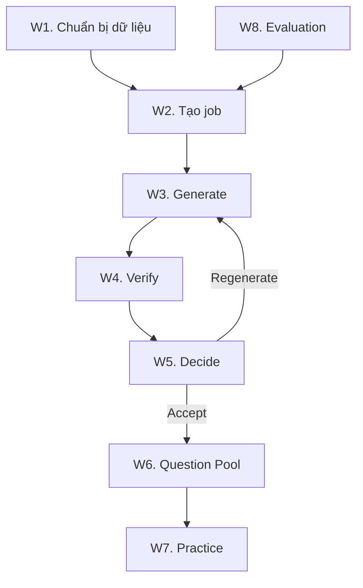
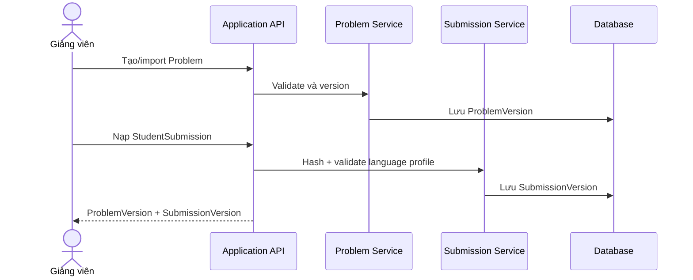
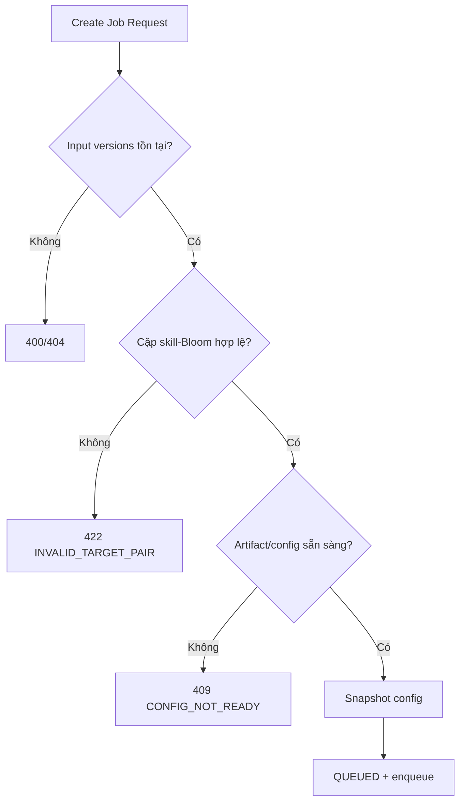
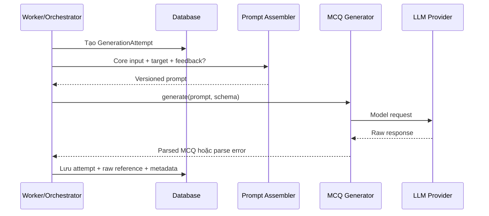
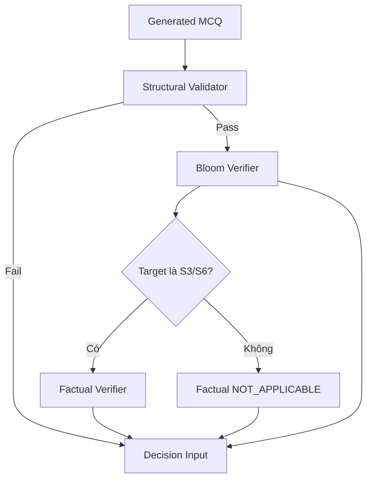
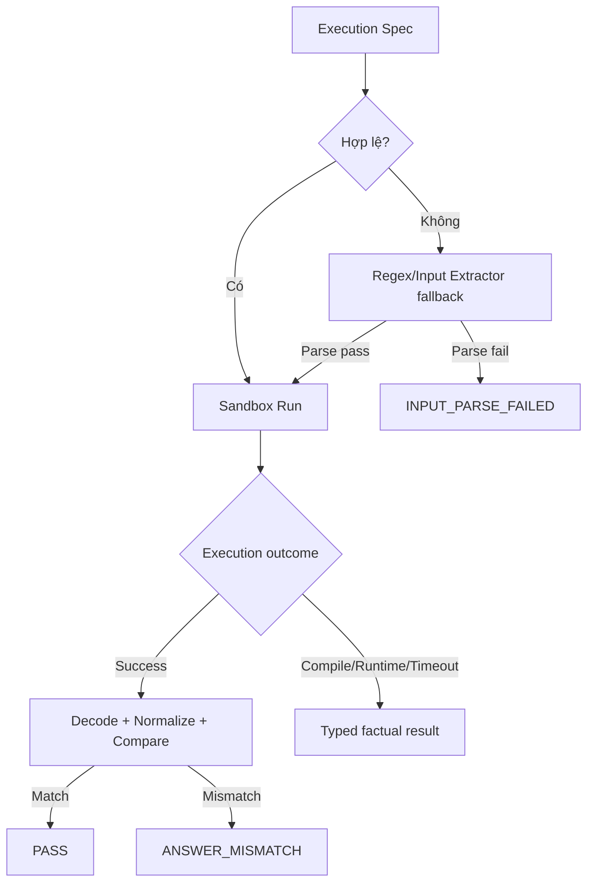
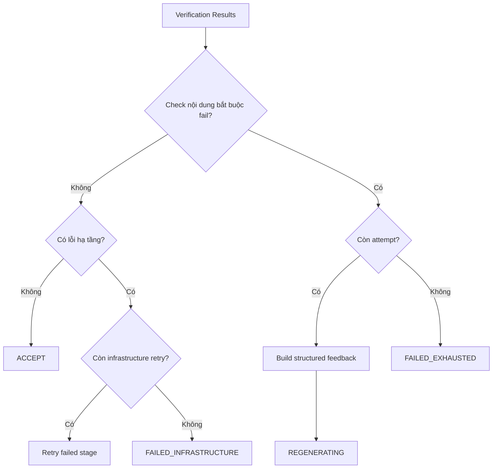
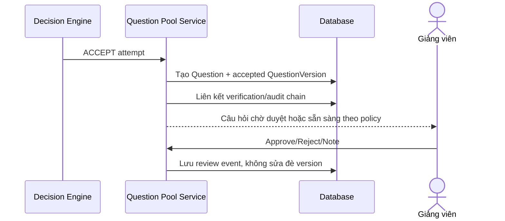
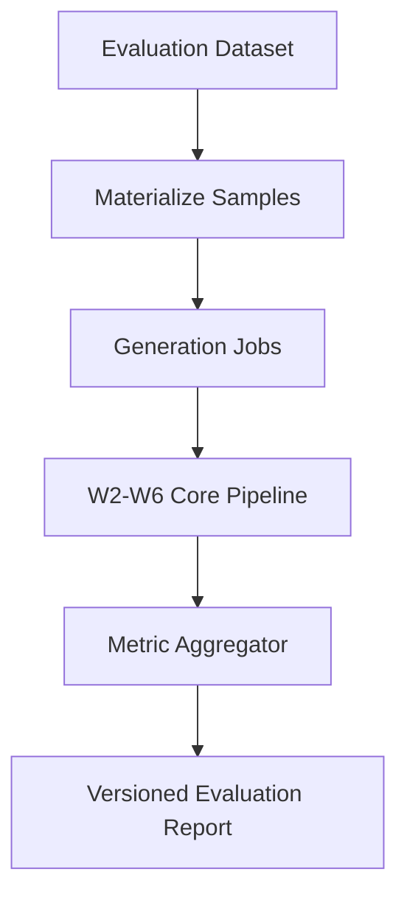

# Workflow hệ thống đề xuất

## Hệ thống sinh và kiểm chứng câu hỏi đọc hiểu mã nguồn sử dụng LLM

Tài liệu mô tả các luồng runtime bám theo [RE_PROPOSED.md](RE_PROPOSED.md) và [SD_PROPOSED.md](SD_PROPOSED.md).

---

## 1. Tổng quan luồng

| Mã | Luồng | Phạm vi |
|---|---|---|
| W1 | Chuẩn bị Problem và Submission | Core |
| W2 | Tạo Generation Job và kiểm tra target | Core |
| W3 | Generate MCQ | Core |
| W4 | Verify Structural + Bloom + Factual | Core |
| W5 | Decide + Regenerate | Core |
| W6 | Publish vào Question Pool | Core |
| W7 | Làm bài và nhận phản hồi | Core demo |
| W8 | Evaluation Run | Core |
| W9 | Bổ sung context bằng RAG | Extension |
| W10 | Adaptive target selection | Extension |



---

## 2. W1 — Chuẩn bị Problem và Submission

### 2.1 Mục tiêu

Tạo snapshot đầu vào bất biến cho generation job.

### 2.2 Luồng



### 2.3 Quy tắc

- Không cập nhật đè ProblemVersion hoặc SubmissionVersion.
- Bài nộp phải gắn đúng problem và language profile.
- Dữ liệu định danh sinh viên dùng pseudonymous reference khi chạy evaluation.
- Nếu bài nộp không hợp lệ, kết thúc ở `INVALID`; chưa tạo generation job.

---

## 3. W2 — Tạo Generation Job

### 3.1 Input

- `problem_version_id`.
- `submission_version_id`.
- `Starget`.
- `Btarget`.
- Các artifact/config version hoặc default đã chốt.

### 3.2 Luồng



### 3.3 Kết quả

API trả `202 Accepted` và `job_id`. Không gọi LLM nếu target không hợp lệ.

---

## 4. W3 — Generate MCQ



### 4.1 Attempt đầu tiên

- Không có regeneration feedback.
- Prompt chứa Problem, Submission, 9-skill/6-Bloom definitions liên quan, target và MCQ schema.

### 4.2 Attempt tái sinh

- Dùng cùng core input và canonical target.
- Nhận structured feedback từ attempt trước.
- Không thay đổi ngầm matrix/model/prompt/policy version trong cùng job.

### 4.3 Lỗi

- Provider timeout/rate limit: infrastructure retry trong budget, không tăng attempt nếu chưa tạo output mới.
- Raw output sai JSON: lưu attempt và chuyển W4 Structural Validator.
- Provider unavailable sau retry budget: `FAILED_INFRASTRUCTURE`.

---

## 5. W4 — Verify

### 5.1 Thứ tự bắt buộc



### 5.2 Structural verification

Kiểm tra:

1. Schema version được hỗ trợ.
2. Có stem, explanation.
3. Chính xác bốn option A–D.
4. Chính xác một correct option.
5. Option không rỗng và không trùng sau normalize.

Nếu fail, không cần chạy Bloom hoặc sandbox; các check sau ghi `SKIPPED_DEPENDENCY_FAILED`.

### 5.3 Bloom verification

1. Serialize MCQ đúng input contract của classifier.
2. Chạy inference bằng artifact version của job.
3. Nhận probability vector theo label order đã đăng ký.
4. Tạo target soft distribution từ `Btarget`.
5. Tính Harmony.
6. Áp threshold policy thành `PASS/MAYBE/FAIL`.
7. Lưu đầy đủ payload và latency.

Model load/inference error là `INFRASTRUCTURE_ERROR`, không phải Bloom `FAIL`.

### 5.4 Factual verification

Chỉ áp dụng cho S3/S6:



Mọi sandbox run phải gắn execution ID, runtime image digest, resource limit và bounded output.

---

## 6. W5 — Decide và Regenerate

### 6.1 Luồng quyết định



### 6.2 Structured feedback

Feedback phải:

- Dùng reason code máy đọc được.
- Chỉ rõ check nào fail.
- Nhắc lại target không được thay đổi.
- Đưa guidance đủ để sửa lỗi, không yêu cầu sinh câu khác ngoài target.
- Giữ các constraint đã đạt, ví dụ bốn option và một đáp án.

### 6.3 Bloom `MAYBE`

Cách xử lý được lấy từ policy version:

- `REGENERATE_ON_MAYBE`; hoặc
- `ACCEPT_WITH_REVIEW_FLAG` nếu mọi check khác pass.

Không được xử lý khác nhau giữa các job dùng cùng policy version.

---

## 7. W6 — Publish Question Pool



Pool cho phép lọc theo Problem, skill, Bloom, model, verification status và review status.

---

## 8. W7 — Làm bài

1. Practice Service chọn accepted/approved QuestionVersion.
2. API loại bỏ `correct_option`, internal feedback, raw output và private evidence.
3. Sinh viên nộp A–D.
4. Server đối chiếu answer key.
5. Lưu QuestionResponse gắn đúng QuestionVersion.
6. Trả đúng/sai và explanation được phép.

Luồng này chỉ cần mức tối thiểu để chứng minh question pool dùng được. Learner modeling là extension.

---

## 9. W8 — Evaluation Run

### 9.1 Tạo run

Evaluation Run snapshot:

- Dataset version.
- Matrix version.
- Prompt version.
- Generator model/version và parameters.
- Bloom artifact version.
- Decision policy version.
- Language/sandbox profile.
- Seed nếu có.

### 9.2 Thực thi



### 9.3 Metric tối thiểu

- Structural pass rate theo attempt.
- Bloom exact và within-1 accuracy trên labeled set.
- Harmony distribution theo target.
- Factual pass/mismatch/parse/error rate.
- Accept rate theo attempt number.
- Mean/median regeneration count.
- Failed exhausted/infrastructure rate.
- Latency p50/p95 theo stage.
- Rubric và inter-rater reliability nếu có human evaluation.

---

## 10. W9 — RAG extension

RAG chạy trước Prompt Assembly nhưng sau khi core input đã được xác nhận:

1. Dựng query từ Problem, target và repository metadata.
2. Lọc corpus theo course/problem/repository/version.
3. Retrieve top-k context.
4. Lưu source reference, score và retriever config.
5. Prompt Assembly đánh dấu retrieved context riêng với student submission.
6. Core Generate–Verify tiếp tục không thay đổi.

Failure behavior:

- Không có context: tiếp tục core pipeline và ghi `RAG_EMPTY`.
- Vector service lỗi: tùy policy, fallback core-only hoặc `FAILED_INFRASTRUCTURE` nếu run bắt buộc RAG.
- Context vượt budget: deterministic truncation/rerank và lưu strategy version.

---

## 11. W10 — Adaptive extension

Adaptive Target Selector nhận learner evidence và trả:

```json
{
  "skill": "S3",
  "bloom": "APPLY",
  "matrix_version_id": "uuid",
  "policy_version_id": "uuid",
  "reason_codes": ["LOW_SKILL_EVIDENCE", "NEXT_VALID_BLOOM_LEVEL"],
  "evidence_refs": ["response-id"]
}
```

Target vẫn phải qua W2 validation. Adaptive module không được tạo cặp `N/A` hoặc thay target trong lúc regeneration.

---

## 12. Luồng lỗi tổng hợp

| Lỗi | Phân loại | Xử lý |
|---|---|---|
| Target `N/A` | Request/domain | Từ chối trước job |
| LLM trả JSON sai | Content | Structural fail → regenerate |
| Provider timeout | Infrastructure | Bounded retry cùng stage |
| Bloom mismatch | Content/pedagogical | Feedback → regenerate |
| Bloom model unavailable | Infrastructure | Retry/circuit breaker/fail infrastructure |
| Factual answer mismatch | Content/factual | Feedback → regenerate |
| Input parse failed | Content hoặc contract | Regenerate với yêu cầu execution spec rõ hơn |
| Compile/runtime error do submission | Input/content | Áp policy đã chốt; không giả thành answer mismatch |
| Sandbox timeout/output limit | Execution safety | Dừng run, lưu typed result |
| Queue redelivery | Infrastructure | Idempotent resume, không tạo duplicate attempt |
| Hết attempt | Terminal content failure | `FAILED_EXHAUSTED` |

---

## 13. Traceability checklist

Một accepted question phải truy được toàn bộ chuỗi:

```text
QuestionVersion
→ Accepted GenerationAttempt
→ GenerationJob
→ ProblemVersion + SubmissionVersion
→ SkillBloomMatrixVersion
→ PromptVersion + ModelArtifact
→ Structural/Bloom/Factual Verification Results
→ SandboxExecution (nếu áp dụng)
→ Decision + PolicyVersion
→ AuditEvents
```

Nếu thiếu một mắt xích bắt buộc, Question không đạt Definition of Done.

---

## 14. Kịch bản demo đề xuất

Demo nên có ba job trên cùng một Problem/language profile:

1. **Happy path:** MCQ đạt Bloom và factual, accept ở attempt 1.
2. **Bloom regeneration:** attempt 1 lệch Bloom, attempt 2 nhận feedback và pass.
3. **Factual regeneration:** attempt 1 có answer mismatch, sandbox phát hiện và attempt sau sửa đúng.

Sau demo, mở Question Pool và trace view để chứng minh toàn bộ metadata/lịch sử được lưu, rồi chạy một evaluation report nhỏ. Đây là bằng chứng rõ nhất cho việc đã hệ thống hóa và hiện thực CodeLit-GV.

